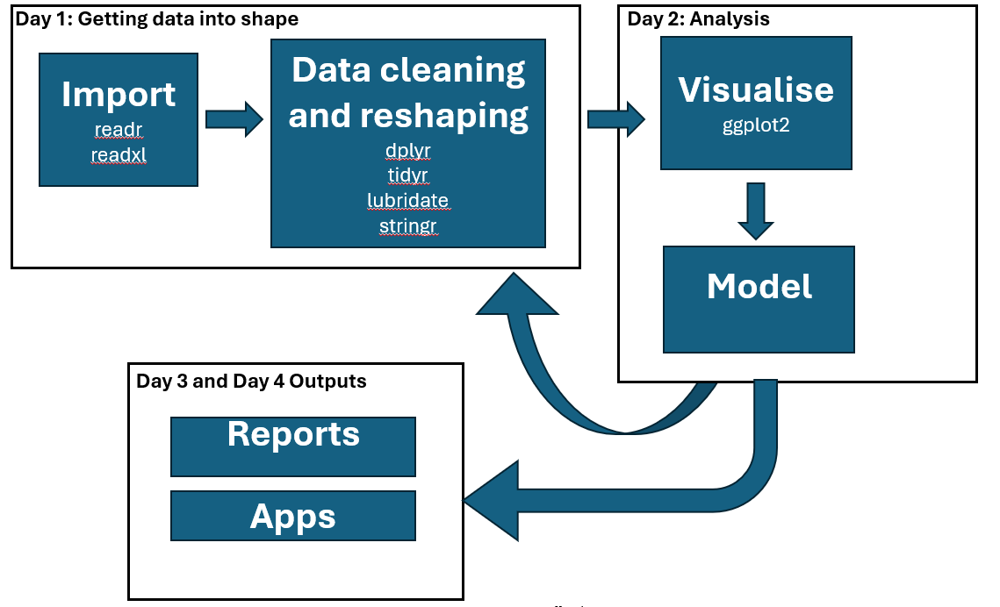
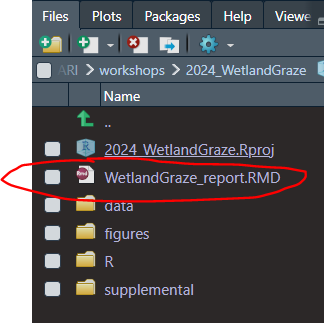
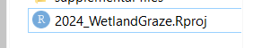
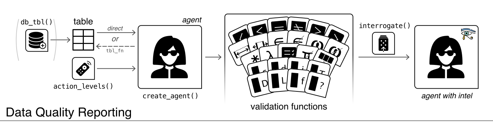

```{r setup, include=FALSE}
  knitr::opts_chunk$set(echo = TRUE, eval=F)
  library(tidyverse)
```

# Day's objectives

-   Understand workflow, why it is important, and how to do it using Rstudio/R
-   Assessing response variable

# Key packages

{width="10%"} {width="10%"} {width="10%"} {width="10%"} {width="10%"} {width="10%"} {width="10%"}

# Workshop project: Wetland Data

Click over to [dataset webpage](https://bfanson.github.io/2024_DADA_workshop/dataset.html) for overview of the wetland data

# Workflows

## Basic of data analysis workflow

A basic workflow for data analysis is shown below. We will be following this workflow through the workshop. This workflow is likely familiar everyone. Here, we demonstrate how `R` (with Rstudio) can be used for every step, so you are using a single tool for every step.

{width="90%"}

## Example of a R/Rstudio workflow

So those are the basics and suspect most will be rather familiar with that workflow. But, examples speak volumes. Let's go through an example of the fundamentals of my R/Studio workflow (I will show a few of my workflow)

Let's review

-   Project folder structure
-   how do you name your project folder so easy to find

{width="40%"}

-   Data storage: three main folders raw, rds, spatial
-   what are the key data folders you need for your project

{width="40%"}

-   R scripts : import/data cleaning, analysis

{width="40%"}

-   structure within the scripts (example of `importData.r`)

{width="90%"}

-   Report writing: Rmarkdown/Quarto file [day3]

{width="45%"}

<aside>Rmarkdown used to be the main report tool in R but recently Quarto has been slated to replace Rmarkdown. I am still using Rmarkdown.</aside>

## Advantages of workflow

-   "laziness" in data analysis programming
    -   reduce cognitive load
    -   reduce distractions (rabbitholes/"the weave")
    -   efficiency
-   collaborations
    -   a logical workflow makes for easy collaborations
-   reproducibility
    -   logical, clean workflows minimise error
    -   every step is explicit in the code [no black boxes]

## Caveat on my R/Rstudio workflow

My R/Rstudio workflow has evolved over the years and reflects historical contingencies (e.g. working as analyst in pharmaceutical for 9 months, influential people I happened to meet).

This workshop will work off this framework but this workflow might not fit you per se. However, for those developing their workflow, it is useful to have an initial foundation in which to work off. So, as we go through this workshop, think about how you personalise the workflow for you:

-   how might you integrate your current process with the workflow presented?

-   what unique aspects of your work need to be integrated into the workflow?

-   what is the role of collaborators and meshing workflows?

Upfront thinking about this is not time-wasted. If you have a great structure that inherently works for you, you will be more efficient.

# Ready, set, go....

Okay, we have the data and understand the project goals, design, and key questions. Let's go through the basic steps to get going...

## P1: Setup your project folder

If new to Rstudio, it is worth checking out youtube tutorials (e.g. [an example one](https://www.youtube.com/embed/FIrsOBy5k58) ).  We will try to show tips and tricks along the way.

1.  Create Rproject using Rstudio

    {width="70%"}

2.  Create folder structure

    {width="45%"}

<aside> Note that "Rstudio" (the company) has rebranded to "posit".  It has also created a new IDE,0  Positron <https://github.com/posit-dev/positron/wiki> for note about new IDE</aside>

3.  Create an `importData.r` script

    

### Important concept of relative paths

Probably the most important attribute of an Rstudio project is the idea of **relative path**. In your analysis, since you are using R code, you will need to point to files using file paths (e.g. "data/raw/data.xlsx").

```{r eval=F}
# you can see the working directory by typing
  getwd()

```

<aside>Notice that I used forward slash "/" instead of backslash "". In R, you need to use forward slash in file paths as backslash are special"escape" characters</aside>

An **absolute path** is the full path "C:/Users/bf0a/workshops/2024_WetlandGraze/data/raw/data.xlsx". If you use absolute path, any time you change your computer or share your project across computers, you will need to change the path. A relative path means that you just need to specify the path from within the project folder.

Given that, it is __important to open your project using the "project_name.Rproj" link__, e.g. {width="30%"}

### Let's talk a look at my standard import script

{width="80%"}

<aside>Click the outline button in upper right of the script screen to show the outline of script. The outline is created by the \#### Text \####</aside>

### Tidyverse

At the top of my script, I put `library(tidyverse)`


\
Tidyverse is big topic but here are key points that I want you know:

1.  Tidyverse is an opinionated approach to data analysis and has spurred a movement of tidy-everything (tidygraphs, tidybayes, sf package, and so much more)

2.  Rather than a package per se, it is really a collection of packages (aka meta-package)

3.  Tidyverse goals

    -   make R code more consistent

    -   make R code more readable for humans

    -   create a cult

#### A few key functions

There are lot of functions in tidyverse world.  Below, I will just quickly introduce a few to show the human-readable attribute and give you your first exposure to what we will use later.  These functions fall (very) loosely into three categories (though not mutually-exclusive): 1) dataset cleaning tools; 2) summarising; and 3) dataset reshaping/joins.

```{r}

#### example below - do not include in your hands-on section script ####

# dataset cleaning tools
  select()  # choose the columns you want [subset by column]
  filter()  # choose the rows you want [subset by row]
  arrange() # sort the columns
  mutate()  # create a new variable

# dataset summarising tools
  group_by()    # implicitly breaks the dataset into separate groups
  summarise()   # performs a summary statistic on each individual group

# dataset reshaping and joining   
  left_join()   # combining columns from two datasets
  bind_rows()   # stacking dataset on top of each other
  
```


```{r cheatsheet, eval=T, echo=F, out.width='100%', out.height='200%'}
  knitr::include_graphics("dplyr.pdf")
```

<br> <br> <br> <br> <br> <br>

#### Pipes: %>%

A key component of tidyverse world is the concept of "pipes". The pipe connects multiples steps into a single sequence of commands.

<aside>Just to make things harder, a new pipe `|>` has been introduced. It is very similar to `%>%` but it does act a little different. We will just teach `%\>%` because we are set in our ways </aside>

Below is an example of building a sentence.  You start with a dataset (or other object) and then do things to that dataset, passing (%>%) onto the next thing thing.  

In Rstudio, there is __shortcut: ctrl + shift + M  to add a pipe...use it!!!!__.

```{r, eval=F}

#### example below - do not include in your hands-on section script ####

  library(tidyverse)
  head(mtcars,10)   # mtcars is a built in dataset
  mtcars %>% head(10)  # get mtcars, pass to head() function, take the first 10 rows 

# sentence using tidy functions we will dive into below...just follow basic logic
  mtcars %>% 
    rename( cylinders = cyl ) %>% # chagne cyl to cylinder
    mutate( mpl = round( mpg/3.79,2 ) ) %>%  # convert mpg to miles per liter (mpl)
    select( mpg, mpl, cylinders )  # keep just the mpg and mpl and cylinders columns 

  #vs.
  ds_m <- rename(mtcars, cylinders = cyl )          # change cyl to cylinder
  ds_m <- mutate(ds_m, mpl = round( mpg/3.79,2 ) )  # convert mpg to miles per liter (mpl)
  select(ds_m, mpg, mpl, cylinders )                # keep just the mpg and mpl and cylinders columns 

```


### Side note - Version control/GitHub [Advanced topic]

As part of my due-diligence, I have to mention version control. In short, version control is external software that keeps track of all your changes (so you can go back if something breaks in your code) and very helpful with collaborations (e.g. allowing you both code away and then merging those changes).

For R/Rstudio, Git/GitHub is the most popular (and can be directly integrated). Now, **Git is the version control software locally on your computer** and it does the tracking of all changes In contrast, **GitHub is an online platform** in which you can upload those changes (and project folder/files) and is mainly useful for the collaboration/sharing (plus some other useful features)

**Key points on Git/GitHub:**

-   If not collaborating, the overhead of Git (learning, initial setup, random breaks) might not worth it to you. You still have version histories via Onedrive to save you (not as easy to shift through as Git).

-   If collaborating, it really is the best approach that will save you effort in the long run.

-   It is worth playing around with GitHub online so you know how to navigate the website (this workshop will help with that). GitHub is a rich resource with example code and useful packages not on CRAN. GitHub project (aka repositories) can look intimidating at first.

-   Rstudio has git integration that makes it easier to work with, though the github desktop

-   GitHub has GitHub pages which is hosting this website [workflow: 1) write RMD files in Rstudio; 2) upload to GitHub; 3) GitHub publishes at <https:username.github.io/project_id>]

-   Researchers will host their packages on GitHub instead of CRAN

<aside>CRAN is repository for packages and is teh default place to look for a package. As CRAN has certain rules/time-lags, some by-pass using other repositories like GitHub</aside>

## P2: Importing data

After setting up environment, on to the import stage

### import philosophy

In my workflow, I view data files as "locked(/read-only)". This is part of the reproducibility pathway. So this means for me:

-   I do not change filenames once the data go in that folder [e.g. if you do, you will forget where your file came and have to go digging]

-   I will not touch anything in the files.

    -   Either I code around (so anyone can see the change)

    -   Send back to get it fix

### Key importing functions

#### excel files

For this, we will use `readxl` package

<aside>There are other read excel packages but this one just works</aside>

```{r eval=F}
#### example below - do not include in your hands-on section script ####

  library(readxl)
  read_xls('data/raw/example.xlsx')
  read_xlsx('data/raw/example.xlsx')

```

You should be aware of how it handles missing data. In `read_xlsx()` you can specify an argument `na=` to indicate what cell values should be treated as missing.

```{r eval=T}
#### example below - do not include in your hands-on section script ####

  library(readxl)
  read_xlsx( 'data/raw/missing.xlsx', na='' ) # default
  read_xlsx( 'data/raw/missing.xlsx', na=c('NA','na') )

```

#### csv/txt

For reading csv/txt

```{r import_readr, eval=F}
#### example below - do not include in your hands-on section script ####

# from readr package in tidyverse
  read_csv('data/raw/example.csv')    # comma delimited
  read_table('data/raw/example.txt')  # tab delimited
  read_delim('data/raw/example.ext', delim='#') # or other type of delimited 
  
  ?read_csv  # to see arguments/options for importing

```

#### Database [Advanced]

Some possible packages to check:

-   `RMySQL`: This package allows you to connect to MySQL databases and execute SQL queries1.
-   `RPostgreSQL`: This package is designed for connecting to PostgreSQL databases1.
-   `RSQLite`: This package is used for SQLite databases and is great for lightweight, serverless database applications1.
-   `RODBC`: This package provides a way to connect to any database that supports ODBC (Open Database Connectivity)1.
-   `RJDBC`: This package uses Java Database Connectivity (JDBC) to connect to a wide variety of databases1.


### Importing our project files (starting with site)

```{r}
#_____________________________________________________________________________
#### Global Variable/Settings ####
  library(tidyverse)  # this brings in all the tidyverse packages
  library(readxl)     # we will need this 

  file_excel <- 'data/raw/Workshop 2024 data.xlsx'   # created new variable to reference
  
#_____________________________________________________________________________  
#### Section 1: site information ####
# check sheet names in excel file
  excel_sheets(file_excel)
  
  # bring in site data      
  ds_site <- read_excel(file_excel, sheet = 'site_info')
  
  # take a look
  head(ds_site)  # quick peak
  View(ds_site)  # check out a datatable version...can also just click the object in the 
                 # environment panel in upper right
  names(ds_site)  # have a look at object names
```

## P3: Data cleaning

### Overview of basics

Now we have the first file in. That is the easy bit. However, we need to clean up dataset(s) so that they are ready for analysis. By cleaning I mean:

-   column management

    -   renaming columns for coding

    -   drop extra columns and extra rows

    -   makes sure column types (e.g. numeric, character, factors, date) are correct

    -   data entry errors in columns

    -   string manipulations (e.g. combine two columns, split two columns)

-   check design (aka get intimate `r emo::ji('heart')` with the data)

    -   extract out the design elements to confirm it matches (or identity where is does not)

    -   missing data [part of design missing?]

-   join together response variables, design, and covariates

-   restructure data for analysis (e.g. long vs wide form)

### column management

#### dropping/keeping columns - `select()`

the `select()` is used to select the columns you want. Here, we use it to drop the two columns we do not. The '...10' was created automatically by `read_excel()` and not needed. We delete the columns using (-) negative in-front of the column we want to drop. We also learn if a column name has whitespace (or other special characters like %, #, ...) you need to use quotes to refer to it.

```{r}
  # let's delete that the extra column... use select(data, -var)
  ds_site <- select( ds_site, -...10)  # drop the ...10
#  ds_site <- select( ds_site, -Drop me)  # this does not work
  ds_site <- select( ds_site, -"Drop me")  # need to use either "Drop me" or `Drop me` if you have whitespace

```

#### renaming columns - `rename()`

You will want to rename columns. It is important to think about what makes a good column name for you. I stick to the following

-   no whitespaces, no special characters, not too long, (for me) all lowercase
-   prefixes or suffixes (useful for select functions) [e.g. dates are dt\_, datetime is dttm\_, site info is site\_)

```{r eval=F}
  # now, let's rename [I will show two ways: rename() and within select() ]
  ds_site <- ds_site %>% 
    rename( site_lat = Transect.Start.Latitude,
            site_lon = Transect.Start.Longitude ) %>% 
    select(cma, wetland=wetland_name, transect_id, fence, grazing, starts_with('site_') )

```

#### check column type and convert - `mutate()`

When you want to create a new column or modify an existing column, `mutate()` is the key function. We used it to convert lat/lon from character to numeric.

```{r  eval=F}
 # now, let's check column type
  head(ds_site)  # <chr> = character
  
  # convert lat/lon to numeric...need to use mutate and will use as.numeric()
  ds_site <- mutate(ds_site, 
                    site_lon_n = as.numeric(site_lon),
                    site_lat_n = as.numeric(site_lat) ) # note the warning
  filter(ds_site, is.na(site_lon_n)|is.na(site_lat_n) )  # warning cause it was missing..will get later from researcher

  # now, I want to keep the site_lat/site_lon column but as numeric 
  ds_site <- select(ds_site, -site_lon, -site_lat) %>% 
              rename( site_lat = site_lat_n, site_lon = site_lon_n )
  head(ds_site) # looking good
```

```{r}
#### example below - do not include in your hands-on section script ####

# commmon conversion functions
  as.numeric()
  as.character()
  as.factor()
  as_date()  # note there is as.Date() and as_date()...use the later
  as_datetime()  # note there is as.Date() and as_date()...use the later

```

For dates, this is another whole topic. I highly recommend you use the `lubridate` package for all date handling. See [date webpage](https://bfanson.github.io/2024_DADA_workshop/d1_lubridate.html) for a bit more info

For factors, be very careful when converting...

```{r}
#### example below - do not include in your hands-on section script ####

# factors are in essence an ordinal in that they are stored as numbers with labels
  intensity <- c('low','medium','high') 
  intensity
  class(intensity) # character
  f_intensity <- as.factor(intensity)
  f_intensity # now a factor and note the levels
  as.numeric(f_intensity) # you get numbers

# here is where the problem comes in...
  ds_fish  <- data.frame( fish_id = c(1,2,6,7) ) # say you have fish id as a number
  ds_fish  <- mutate(ds_fish, f_fish_id = factor(fish_id) ) # you convert fish_id to a factor for a model  
  mutate(ds_fish, fish_id = as.numeric(f_fish_id) ) # you want to join it to another dataset and it needed to be numeric, you use as.numeric() you get the wrong numbers
  # note - this use to be a bigger problem pre-tidyverse0
  
```

#### data issues and using `filter()`

Next, we checked each column of interest to see if it matched our expectations. We introduced a string function `str_to_sentence()` to help. You also saw `filter()` and how to use that. The operators for `fitler()` are ==, !=, %in%. \<aside\>There are tons of string functions. Check the cheatsheet.

<aside>We also learned about `pull(data, var)` vs `data$var` way of getting a specific column from the dataset</aside>

```{r eval=F}
# first, you need to learn to grab a single column from a dataset
  pull(ds_site, cma)  # this is tidyverse way
  #vs
  ds_site$cma  # this is the old base way
  
  # I will use $ method here as this is more common (or maybe I am just old(-school) )
  table(ds_site$cma) # looks good
  
  table(ds_site$wetland) # looks good, no misspellings obvious, numbers not exactly 10
  
  table(ds_site$fence) # oops, yes vs Yes...capitalisation matters
  ds_site <- mutate( ds_site, fence = str_to_sentence(fence) )  # let's use a string function
  table(ds_site$fence) # Too easy!
  
  table(ds_site$grazing) # okay, was excepting just Crash/Press - was not expecting
  ds_site <- filter(ds_site, grazing != 'NIL' )  # ! is used to say not
  ds_site <- filter(ds_site, grazing %in% c('Crash','Press' ) )  # or you inverse way 
  table(ds_site$grazing) # all good


  
```

## P4: summarising data

After you did initial column cleaning, we explored the experimental design to make sure that it was as expected. We found several issues and fixed them. We covered `group_by()` and combining with `count()`, `summarise()`, and `mutate()`. The key difference between `summarise` and `mutate` is that summarise returns a single row per group whereas mutate returns all initial row, adding in a the new variable.

Once grouped, the data stays that way until you `ungroup()` the data. **This will trick you up!!!!** If you do a calculation and cannot figure out why it is very wrong, check if data are still grouped. It is best to always `ungroup()` but that is not reality.

<aside>If you want to take the first(/last) number of rows, check out the family of `slice()` functions in dplyr. See the dplyr cheatsheet for examples</aside>

Also, we saw a 'special' function `n()` that you can use to call to get the number of rows in a group.  Another useful function is `row_number()` which will give you the row number within each group (or the whole dataset is ungrouped).

```{r}
##### let's check experimental design #####  
  
  # Now, I want to understand this transect_id.  Is it unique?
  # option1 - if unique, then there will be one per wetland
  ds_dups <- group_by(ds_site, wetland, transect_id) %>% count(name='n')  # count() 
  filter(ds_dups, n > 1)  # there are 8 were it is not
  
  # okay, not expecting that...let's add in the number of duplicates so can understand better
  ds_site <- group_by(ds_site, wetland, transect_id) %>% 
              mutate( n_dups = n() )  # we use mutate here so it keeps all rows
  filter(ds_site, n_dups==2)          # both No and Yes
  filter(ds_site, n_dups==2) %>% distinct(wetland)  # in three wetlands...
    # in the above code, I use distinct() to return the unique level for wetland
    # but as you saw, it returned transect_id as well.  This is because dataset is still grouped
  ds_site <- ungroup(ds_site)
  filter(ds_site, n_dups==2) %>% distinct(wetland)  # in three wetlands...
  
  # I was told that this was a data entry error and I should drop the Fence==No ones 
  filter(ds_site, n_dups==2 & fence=='No')  # let's see the ones to drop..n=8
  nrow(ds_site)
  ds_site <- filter(ds_site, !(n_dups==2 & fence=='Yes') ) # 
  nrow(ds_site)  # 300-8 = 292...all good
     
 # I want to know how many transects in each...let's use group_by() and summarise()
  ds_sum <- ds_site %>% 
              group_by(wetland, fence) %>%  # break up into separate wetlands and do a calculation on each group
              summarise( n_transects = n() )
  filter(ds_sum, n_transects!=5)  # huh, thought there were only 5, check with researcher why

```

### Few other examples

```{r}
#### example below - do not include in your hands-on section script ####

  mtcars # built in dataset
  group_by(mtcars, cyl) %>% summarise( mean_mpg= round(mean(mpg),1), 
                                       sd_mpd= round(sd(mpg),1),
                                       n = n() ) # n() is built in to count rows
  # if you replace the same variable, all next calculation will be on the summarised variable
  group_by(mtcars, cyl) %>% summarise( mpg= mean(mpg) %>% round(2), 
                                       max_mpg= max(mpg)%>% round(2),
                                       min_mpg= min(mpg)%>% round(2) ) # see how min/max same

```

## P5: Restructure datasets

### Overview

Restructuring is like a pivot table in Excel.  It is going from wide to long (and vice versa).  In our script, we used `pivot_wider()`.  The reverse function is `pivot_longer()` which we did not use here.

```{r}

# I want to know the transect number differ between plot or are equal...restructure
  ds_sum_wide <- pivot_wider( ds_sum, names_from=fence, values_from=n_transects )
  head(ds_sum_wide)
  filter(ds_sum_wide, No != Yes )  # might be worth double-checking if supposed to be
 
```

### use of `distinct()`

We finished off Section 1 by using the distinct() [so more]. `distinct()` is really useful for extracting out design. `distinct()` finds the unique combination of all the variables listed in the function. We used to get the unique combination of wetland, grazing, fence. You also saw `n_distinct()` which is useful in mutate to count the number of unique levels in variable.

```{r}
# let's check that the number wetland per cma
  group_by(ds_site, cma) %>% summarise( n_wetland = n_distinct(wetland) ) # option 1
  distinct(ds_site, cma, wetland) %>% group_by(cma) %>% count()  # options 2
  
  # let's check full design using some of the techniques above
  ds_design <- distinct(ds_site, wetland, grazing, fence) %>% 
                group_by(wetland) %>% 
                  summarise(n_grazing=n_distinct(grazing), 
                         n_fence = n_distinct(fence) )
  # any 
    filter( ds_design, n_grazing>1 ) # nothing
    filter(ds_design, n_fence!=2) # nothing
  
# we have wetland, grazing, fence, transect_id but missing temporal component
```

## Importing survey information

### Missing values

<aside>NA can be tricky. In statistical models, any row with NA will be dropped quietly. When using functions like mean(), sd(), NAs will return NAs.</aside>

A new topic learned in Section 2 was NAs. We used the `is.na()` function to filter out this cells. NA are special characters and you cannot just do `filter(ds_site, wetland==NA)` or `filter(ds_site, wetland=='NA')`. The former statement caused `R` to look for a variable called 'NA' and the latter makes `R` look for variable level 'NA'.

<br>

```{r}
#_____________________________________________________________________________  
#### Section 2: import survey info ####
  ds_survey <- read_csv('data/raw/df_survey_info.csv') 
  ds_survey
  
  ds_survey <- ds_survey %>% 
                  select(-...1) %>% 
                  rename( dt_survey = date ) # I prefer dt_xxx for my dates
  # check columns
  ds_survey  # all <chr> except for <date> as expected
  summary(ds_survey) # missing dates for dt_survey
  
  # let's check out the NAs...using is.na() function
  filter(ds_survey, is.na(dt_survey))  # ...check with researcher
  ds_survey <- filter(ds_survey, !is.na(dt_survey) )  # let's say they should be deleted

  # I would check if any transects not in the site dataset
  filter(ds_survey, !(transect_id %in% ds_site$transect_id) )
  filter(ds_site, wetland == 'Hoch') # yep no wetland that is Hoch...oh that is right, it is the NIL we dropped
  
  filter(ds_survey, str_detect(transect_id,'Hoch')) # we want to drop these
  ds_survey <- filter(ds_survey, !str_detect(transect_id,'Hoch')) # drop them

  # okay, I want to check out dates 
  ggplot(ds_survey, aes(dt_survey)) + geom_dotplot()  # showing a graph...matches our expectation (no odd date)

  # survey dataset is looking good
  #now let's join survey info and site info 
  # first, I want to create wetland in the survey dataset
  # I noticed an NA in graph
  ds_survey <- separate_wider_delim(ds_survey,
                                    cols = transect_id,
                                    names=c('wetland','transect_no'),
                                    delim='_',
                                    cols_remove=F)
  ds_survey 
  ds_survey <- ds_survey %>% select(-transect_no) # not needed at this point
  
  # second, check that there are not duplicates for survey_id, dt_survey
  group_by(ds_survey, survey_id, dt_survey) %>% count() %>% filter(n>1) # yippe, all clean
      
```

## P6: Joining datasets

-   merges/combining joins

    {width="30%"} {width="23%"} {width="30%"}

```{r}
#### example below - do not include in your hands-on section script ####

# whole suite joins....
  left_join()  # stick this one
  right_join() # just switch around to left_join
  full_join()  # safer to create the fuller design (e.g. expand.grid) and then left_join() into it
  inner_join() # safer to do left_join() and then filter()
  outer_join() # just stick to left_join and filter()


```

### Commentary on merges/join (left_join)

You will join datasets all the time. In joins, (usually) you have two datasets and have something in common (e.g. site_id). For instance, you may have response variable in one dataset and covariates in another. You want to combine together.

Be warned, **joins can be major pitfalls!!!!** If you are not intimate `r emo::ji('heart')` with your datasets, it can lead to big issues. We showed this in our code in which we "forgot" to include transect_id:

```{r eval=F}

# as an example, left_join will warn you if it is not a one-to-one join
  ds_mistake <- left_join( ds_survey, select(ds_site, wetland, fence, grazing) )
  nrow(ds_mistake) # way bigger

  
```

What happened here is called a one-to-many join. I was expecting the left dataset (the first dataset) to have the same number of rows before and after the join. Instead, it has more, creating fake data (repeated) in essence (and increasing sample size, decreasing SEs, leading to erroneous stats). Therefore, you really need to keep tabs on number of rows.

Luckily, `dplyr::left_join()` brought in a warning for this (I had my own function to warn me about this). My advice for you is to only use `left_join()` and make it a one-to-one join. Be careful being fancy in one-to-many and many-to-many (`full_join`) joins. Sometimes it is safer to work in separate steps rather than one big step.

### Join for our project

Now that is off my chest, let's recall the joins we needed for our project...

```{r eval=F}
# now join in grazing, fence info...use a left_join and join by wetland, transect_id
  nrow(ds_survey)
  ds_survey <- left_join( ds_survey, 
                          select(ds_site, wetland, transect_id, fence, grazing) )
  nrow(ds_survey) # same number as before, all good
  
  # as an example, left_join will warn you if it is not a one-to-one join
  ds_mistake <- left_join( ds_survey, select(ds_site, wetland, fence, grazing) )
  nrow(ds_mistake) # way bigger
  
#_____________________________________________________________________________  
#### Section 3: import richness ####
  excel_sheets(file_excel)
  ds_richness <- read_excel(file_excel, sheet='spp_rich' )
  ds_richness  # column types look good
  
  # only keeping native
  ds_richness <- select(ds_richness, survey_id, native)
  
    
  # let's add richness to ds_survey
  # going to do a few checks
  filter(ds_richness, !(survey_id %in% ds_survey$survey_id) ) # all good!
  
  # do a histogram/density plot
  ggplot(ds_richness, aes(native)) + geom_histogram() + 
    geom_density(aes(y=after_stat(count) ),alpha=0.2, fill='red') # no obvious outliers at this point

  # add richness to ds_survey 
  ds_richness_out <- left_join(ds_survey, 
                         ds_richness)
  ds_richness_out  
  
  filter(ds_richness_out, is.na(native)) # 46 rows of NA...check with researcher

```

### Concatenating - Stacked joins

I did not use concatenating in this dataset. A common use for this is when you have multiple files produced that have the same data structure (e.g. acoustic data from loggers, camera trap data, acoustic moth data) and you need to stack them together for the analysis. You will use `bind_rows()` for that.

```{r eval=T}
#### example below - do not include in your hands-on section script ####

  ds1 <- data.frame( plot='plot1', quadrat=1:2, species_richness=c(10,20), comments=c('none','something'))
  ds1
  ds2 <- data.frame( plot='plot2', quadrat=1:2, species_richness=c(2,4))
  ds2
  
  bind_rows(ds1, ds2)  

```

<aside>there is a `bind_cols()` to add columns next to each other. I rarely use, preferring to use a `left_join()` to make sure everything lines up</aside>

## P6: Saving the data files

Finally, we have sparkly-clean datasets (and hopefully no hidden dirt under the rugs). The final step in the `importData.r` is to save in the `data/rds` to be used for the next step: modelling!

### RDS approach

At the end of the import and clean stage, I save the dataset(s) as an RDS file. The advantage of this method is that you are saving the dataset(s) in native R format so when you bring back in, there is no conversion.

```{r}
#_____________________________________________________________________________  
#### Section 5: save datasets ####
    
  saveRDS(ds_richness_out, 'data/rds/ards_richness.rds')    
  saveRDS(ds_ht_out, 'data/rds/ards_height.rds')    

```

### Excel

You may want to save an excel file to share. You will need the `writexl` package for this.

```{r}
# excel file
  writexl::write_xlsx( ds_richness, 'data/export/ards_richness.xlsx') 

```

### CSV/Table

Or if you prefer low overhead files (smaller size).

```{r}
 readr::write_csv( ds_richness,file='ards_richness.csv')
 readr::write_delim( ds_richness,file='ards_richness.txt',delim = '\t') # tab
 
```

# Help!!!!!!!!

When learning and using R, you will get stuck and need help. There are variety of help sources we use on a daily basis.

1.  Built-in to Rstudio are help files. This provides an initial starting place if you are interested in how to use a specific function. You just need to put "?" before the function and press run: `?mean()` or use the `Help` tab

2.  Google search (e.g. stackoverflow, blogs) can be really helpful for finding new functions, packages, etc.

3.  Biometrics - happy to provide guidance/tips/thoughts

4.  ARI's QEARI - hacky hour or Teams chat

{width="60%"}

5.  AI is becoming more and more useful [I am finding the most useful].  See page on [AI](https://bfanson.github.io/2024_DADA_workshop/d1_ai.html)


# Hands-on component

```{r download_data, eval=T, echo=FALSE, code_folding = FALSE}
library(downloadthis)
  download_link(
    link='https://delwpvicgovau-my.sharepoint.com/:u:/g/personal/ben_fanson_deeca_vic_gov_au/EW7Gq9EXVetFkpM4nIi3k10Bo8TAyze6LuoMC6Z1zu4rTA?e=sWJhQU',
    output_name = "data.zip",
    button_label = "Download project data",
    button_type = "warning",
    has_icon = TRUE,
    icon = "fa fa-save"
  )
```

<br>

::: {#task_rproj .greeting .message style="background: lightgrey;"}
**Your Task:** Create your Rproject for the workshop and import data for analysis-ready datasets

1)  Download the workshop data (refer to dataset webpage for background info if needed)
2)  Setup your workflow
    -   think about your naming convention for the project names (does it have year, projectID, client). [My standard is "{Year}\_{Researcher}\_{Topic}"]
    -   create Rproject
    -   create folder structure (how do you want yours to look?)
3)  add in datasets to your data folder [e.g. data/raw/]
4)  create your import script file [add to your script folder]
    -   what is your naming convention for R script (e.g. importData.R, 01_import.R, bringInData.R)
    -   create your R script structure (e.g. do you have headers, bookmarks)
5)  fill in script for what we have done so far
    -   go through this "lecture" and grab script and paste into your script
    -   test it along the way - paste in, highlight and run
6)  **finally, write your own script to bring maximum plant height tab**
    -   import plant height data from excel file
    -   clean the data
    -   merge into the species richness dataset
    -   save as a plant height RDS file (and try writexl)
7)  Check compare your version to my using link below\
:::

<br><br>

Below is the link to my Rproject version:

```{r dwnldProject_hands, eval=T, echo=FALSE, code_folding = FALSE}
library(downloadthis)
  download_link(
    link="https://delwpvicgovau-my.sharepoint.com/:u:/g/personal/ben_fanson_deeca_vic_gov_au/EVkSSfqlA01Hiocl8q-ut3YBYnZV3iPh2jIcNMsVT8HHKw?e=zfocIw",
    output_name = "day1Project",
    button_label = "Download Rstudio project",
    button_type = "warning",
    has_icon = TRUE,
    icon = "fa fa-save"
  )
```

<br>

::: {#task_rproj_easy .greeting .message style="background: lightgrey;"}
**Permutation for Newbies**

If your are new to R, you may have found the material a bit overwhelming. If so, it may be best to just download the Rproject that I have created for today and work your way through that.

**Steps**:

1.  Download the Rproject folder (see button above)

2.  Save in your preferred location on your laptop

3.  Open the project by double clicking using the file with the `.Rproj` extention

    

4.  Once in Rstudio, open the `r/import.R` file

5.  Run through the script highlighting each section and clicking Run button (or Ctrl+Enter shortcut)
:::


# Advanced topics [Advanced]

## Quality check packages

If you know that you will be updating the import of files repeatedly, it can be worthwhile to do some upfront QC/QA checks to ensure that the data coming in is clean. There are some packages to help with that.

A few things to consider with these QA/QC:

-   Are your data coming a database that **already implements QA/QC** [ideal world]
-   Are you working with **large datasets** (lots of columns, separate tables)
-   Is this an ongoing project so you will be **updating regularly** the analyses
-   Is there an **automation process** [press run and get outputs at the end]

If you working with clean data or once off datasets, it may be best to just write your data cleaning checks as we have done here. The overhead of these packages unlikely to outweigh the added benefits. Once you are automating/updating dataset, the overhead is often easily outweighed.

Here are two packages to have a look at...

### `validate` package

You can find an overview of this package on its [github page]()

The validate package is intended to make checking your data easy, maintainable, and reproducible.

### `pointblank` package

You can find an overview of this package on its [github page]()

This package takes an data.frame, runs through a bunch of checks on each column and provides an useful report highlighting errors and warning (might be an error).

The basic steps are below in their graphic:



**My thoughts**: This package seems like a step-up in level of QA/QC from validate. I have used a few times but have not regularly implemented due to overhead. Probably becuase my brain is full, it takes a bit of re-leaning each time and I have not taken the time to create a template that minimises that effort.

## Big Data

When data starts to get big (millions of row), tidyverse can struggle with speed. This is huge topic but will direct you to a couple useful packages that allows you to just learn dplyr but use other quicker processes

-   `dtplyr` [package](https://dtplyr.tidyverse.org/)

    -   under the hood it uses the `data.table` [package](https://cran.r-project.org/web/packages/data.table/vignettes/datatable-intro.html)

    -   but you write code in tidy/dplyr

-   `dbplyr` [package](https://dbplyr.tidyverse.org/) [if working with a database]

    -   has the database do all the processes and return the result back to R
    -   takes advantage of cloud computing

## Learn functions

A fundamental skill in coding is creating functions. Packages are basically just collection of functions. I write functions all the time. This helps keep code clean, are reusable (so saves time), helps prevent cut/paste errors, and improves readability/reproducibility. Definitely worth learning as some point.

```{r}

my_plus_function <- function(x,y){
    x + y
}

my_plus_function(1,2)

```

# Resources

Obviously, we have only scratched the surface of the topics here. Here are couple books I have used but lots out there.

[R for Data Science](https://r4ds.hadley.nz/)

[Advanced R](https://adv-r.hadley.nz/)
