```{r setup, include=FALSE, eval=T}
  knitr::opts_chunk$set(echo = TRUE, eval=F)
  library(tidyverse)

 table_font <- function(x){
    font(x, fontname='Calibri', part='all') %>%
          fontsize( size = 10, part = "all") %>%
          bold( part='header') %>%
          fontsize( size = 9, part = "body") %>%
          bg( bg='#01528B', part='header') %>%
          color( color = 'white', part='header') %>%
          border_outer(border =  fp_border_default(width = 0), part = "all") %>%
          hline_bottom()    
    }
```


# Collecting data for today 

__Note - if online you can enter your height__

As part of the presentation today, we will use data we collect from simple measurement experiments.  We have set up two stations in order to collect some data.  The data will be entered into an [online form](https://forms.office.com/Pages/ResponsePage.aspx?id=99a96Bj8SE6lVH9UeSciO_jxmSYRDoFOhTU8JmLuRA5UMlQ4WEcwTk9YT0RFUTBWMkpUVkxKUDFSRS4u)

{width="40%"}

### Station 1: Flipping of coins

There are two coins at the table and you will flip each coin following the steps below (and listed on the online form).  One coin has a washer attached ("Weighted") and a regular ("Fair") coin.

__Steps:__

1. Select one coin
2. Flip that coin, collecting the number heads you get after 1, 5, 10, and 25 flips.
3. Enter data into form
4. Repeat the same steps for the other coin

{width="50%"  }


### Station 2: Measuring "Eel" Wayne and your height

You will measure the height of the cutout of Wayne holding the eel 

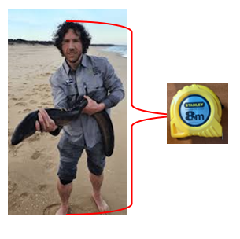{width="40%"}

__Steps:__

1. Measure the height of Wayne from the floor to top of head (top of hair) 
2. Enter data into online form
3. Enter your height on the form [rough estimate fine]


------------------------------------------------------------------------


# Day's objectives

<style>
@keyframes blinker {
  50% { opacity: 0; }
}
</style>


[A REMINDER TO START RECORDING]{style="color: red; font-size: 20px;font-style: italic;animation: blinker 1s linear infinite;"}


-   Understand what are statistical probability distributions
-   Learn some common distributions in ecology and be able to describe their key components
-   Learn what are observation vs state processes and how it fits into statistial models
-   Learn to read(/write) statistical equations `r emo::ji("fear")`
-   Set the stage for the next three days


# Key packages used today

{width="10%"}{width="10%"}

------------------------------------------------------------------------


# Housekeeping

[Course overview on website](https://bfanson.github.io/2025_Models_workshop/course_overview.html)


------------------------------------------------------------------------


# Introduction to statistical distributions

## There are lots of them...

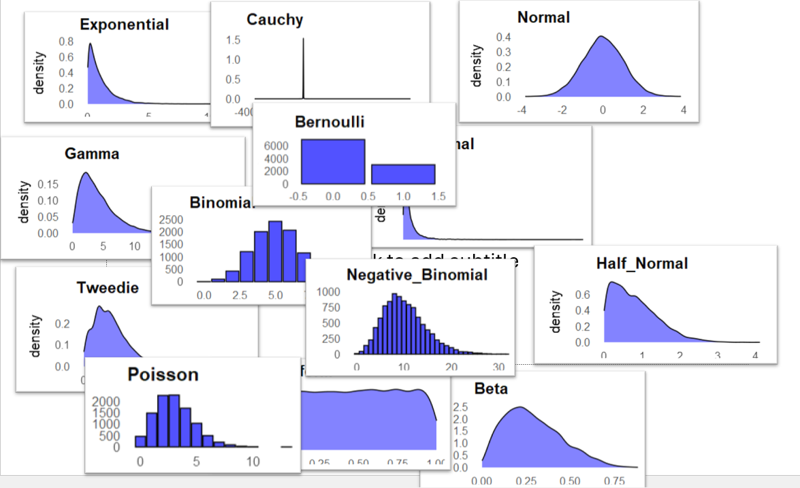{width="90%"}

Well over 100 named distributions


## What creates distribution in our data???

1) measurement error
      -  limits of measurement tools (accuracy, user-error)
      -  miscounting number of birds in large aggregations
      -  data entry/workflow errors

```{r  eval=F, echo=F}
#-- code to grab survey data

  path_survey <- 'C:/Users/bf0a/OneDrive - Department of Energy, Environment and Climate Action/Documents/Projects/2025_Workshop/Measurements.xlsx'
  ds_surv <- readxl::read_excel(path_survey) %>% 
              rename_all(tolower) %>% 
              select(id, starts_with('fair'),starts_with('weighted'), contains('height')) %>% 
              pivot_longer(col=-id, names_to='question',values_to='response') %>%
              mutate(response=as.numeric(response),
                     exp = ifelse( str_detect(question,'coin'), 'coin','height' ),
                     trt = case_when( exp=='coin' ~ str_split_fixed(question,' ',2)[,1],
                                      str_detect(question,'wayne') ~ 'measurement',
                                      str_detect(question,'your height') ~'height',
                                      TRUE ~ 'error'),
                     n_total = ifelse( exp=='coin', str_extract(question, '[0-9]+'), NA ) %>% as.numeric() )
  ds_coin <- filter(ds_surv, exp=='coin') %>% select(id, trt, n_total, n_success=response)
  ds_ht <- filter(ds_surv, exp=='height') %>% select(id, trt, height=response)
```


```{r  eval=F, echo=F, fig.height=3, fig.width=4}
  ggplot(ds_ht %>% filter(trt=='measurement'), aes(height) ) + geom_histogram() +
    geom_vline( aes(xintercept=mean(height)), lty=2, col='blue' )
```

2) result of a stochastic process [e.g. probabilistic events like coin toss, survival rates]

__coin toss experiment__

let's take a look at the data...

```{r plot_measurement, eval=F, echo=T, fig.height=3, fig.width=4}
  ggplot(ds_coin %>% filter(n_total==25), aes(n_success) ) + geom_histogram(col='white') +
    facet_wrap(~trt) + labs(x='No. of successes')

```

__animal spacing__

Let's walk through the classical ecology course on animal  spacing...
   
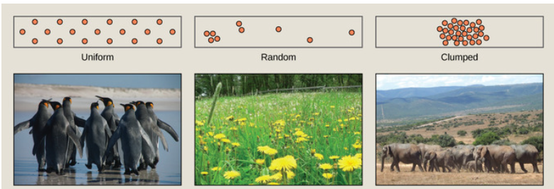{width="80%"}
   
<span style="font-size:80%">from https://bio.libretexts.org/Bookshelves/Introductory_and_General_Biology</span>
   
__Scenario:__ Imagine we setup a sampling transect of 100 grid that we search for the presence of bird. There are 200 birds that distribute themselves among the 100 grids, differing in degree of spacing from uniform to random to modest clumping. 

```{r, eval=T, echo=T, include=T, fig.height=3, fig.width=8}
# simulate classical spacing of animals
  n_grids <- 100
  n_birds <- 200

  set.seed(12)
  p <- rbeta(n_grids,1,6) # preferences of grids for clumped
  ds_all <- tibble( grid_id=1:n_grids, 
                    `1) equal`=rep( round(n_birds/n_grids), n_grids) ,
                    `2) random`= rmultinom(1, n_birds, prob=rep( 1/n_grids,n_grids) ),
                    `3) clumped` = rmultinom(1,n_birds, prob=p/sum(p) ) ) %>% 
            pivot_longer( cols=-grid_id, names_to='type', values_to='n' )

#--- visualise the results ---# 
 ds_stat <- group_by(ds_all, type) %>% summarise( mean=round( mean(n) ), sd= round(sd(n),1) ) 

 ggplot(ds_all, aes(n) ) + geom_histogram(binwidth = 1,fill='grey', col='black') + facet_wrap(~type) +
      geom_text(data=ds_stat, aes( x=3, y=Inf, label=paste('Mean=',mean,'(SD=',sd,')') ), 
                vjust=2, hjust=0 ) +
        labs( x='No. birds per grid cell', y='Count' ) 

```

__Example of from height data__

Let's look at height data...

```{r  fig.height=3, fig.width=5, eval=F, echo=T}
  ggplot(ds_ht %>% group_by(trt) %>% mutate(height=height-mean(height)), 
         aes(trt, height) ) + geom_violin() + labs(x='Source')

```


## Why care about it? 

- __Filtering out signals from the noise__

```{r echo=F, eval=T, fig.height=3, fig.width=8}
set.seed(123)

# Generate data for increasing sample sizes
sample_sizes <- c(2,5,10,25,50,100,1000)
true_mean <- 10
true_sd <- 2

# Create a data frame with sample means and confidence intervals
data <- lapply(sample_sizes, function(n) {
  sample <- rnorm(n, mean = true_mean, sd = true_sd)
  sample_mean <- true_mean # mean(sample)
  se <- true_sd / sqrt(n)
  ci_lower <- true_mean - 1.96 * se
  ci_upper <- true_mean + 1.96 * se
  data.frame(
    sample_size = n,
    mean = sample_mean,
    se=se,
    ci_lower = ci_lower,
    ci_upper = ci_upper
  )
}) %>% bind_rows()

# Plot 
ggplot(data, aes(factor(sample_size), mean, ymin=ci_lower, ymax=ci_upper)) + 
  geom_hline( yintercept = true_mean,lty=2) +
  geom_pointrange() +
  labs( x='Sample size', y='Mean + 95%CI' )

```


```{r echo=T, eval=F, fig.height=3, fig.width=8}
# height data
#  d <- dslabs::heights  # backup data if cannot download from form
  d <- ds_ht %>% filter(trt=='measurement')
  d <- map_df( 3:30, ~ data.frame( mean_ht=mean(d$height[1:.x]), 
                                             sample_size = .x, 
                                              se = sd(d$height[1:.x])/sqrt(.x)  ) )
  ggplot(d, aes(sample_size, mean_ht, ymin=mean_ht-se, ymax=mean_ht+se ) ) + geom_pointrange()

```


- __Quantifying that noise to understand ecological processes__

Random effects of height for quantitative genetics [e.g. hints about stabilising selection, gene-environment interactions]

e.g. "male vulnerability hypothesis" to try to explain differing variation between human sexes

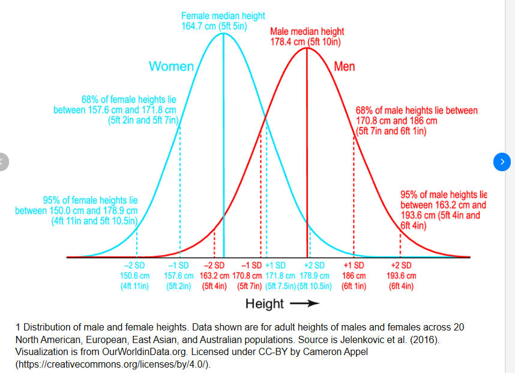{width="80%"}


Types of selection

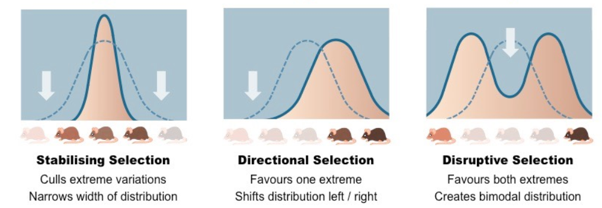{width="80%"}


- __Bayesian statistics relies very heavily on__


{width="80%"}

<span style="font-size:80%">from https://numustafa.medium.com/</span>

- __Making predictions with estimates of uncertainty__

Take a look at normal in the [Shiny App](https://arisci.shinyapps.io/DistributionsBiometrics/)

## Key properties statistical probability distribution

### Type: continuous vs discrete

A _continuous distribution_ in statistics refers to a probability distribution in which the random variable can take any value within a given range, often an interval on the real number line.

A _discrete distribution_ is a type of probability distribution that describes the likelihood of outcomes for a discrete random variable — one that can take on countable values, often integers or categories.

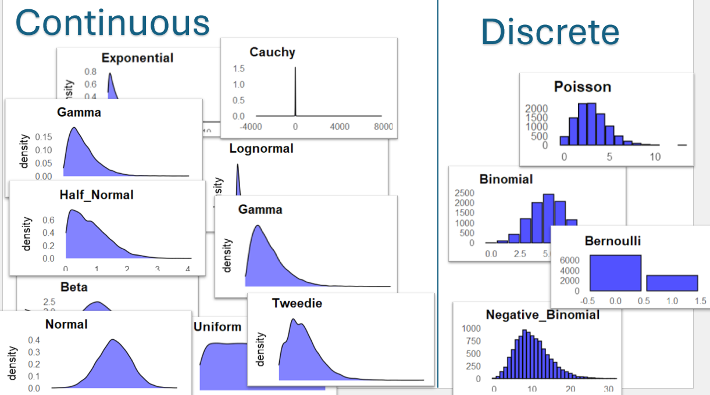{width="100%"}


### Location: means and median

__Mean:__ $\mu = \frac{1}{n} \sum_{i=1}^{n} x_i$ [average value]

__Median:__ the 50th percentile value (middle value)... for {1,2,3,4,5}, median=3

_Bonus: what is the mode?_

```{r echo=F, eval=T, fig.height=3, fig.width=8}
set.seed(123)

# Generate data
ds_all <- bind_rows(
                  data.frame( type='Normal', x = rnorm(5000, mean = 0, sd = 1) ),
                  data.frame( type='Skewed', x =  rgamma(5000, shape = 2, scale = 1.5)),
                  data.frame( type='Bimodal', x =  c(rnorm(2000, mean = -1, sd = 0.5), 
                                                     rnorm(2000, mean = 2, sd = 1) ) ) ) %>% 
            mutate( type = factor(type, c('Normal','Skewed','Bimodal')) )

# Combine into a data frame
# Plot

ds_stat<- group_by(ds_all, type ) %>% 
              summarise( mean=mean(x), median=median(x)) %>% 
            pivot_longer(cols=-type, names_to='stat', values_to='x' )

fig <- ggplot(ds_all, aes(x = x, fill = type)) +
  geom_density(alpha = 0.6) +
  facet_wrap(~type, scales = "free", nrow=1) +
  theme_minimal() +
  labs(title = "Density Plots of Different Distributions",
       x = "Value", y = "Density") +
  theme(legend.position = "none")

ds_stat<- group_by(ds_all, type ) %>% 
              summarise( mean=mean(x), median=median(x)) %>% 
            pivot_longer(cols=-type, names_to='stat', values_to='x' )

fig + geom_vline(data=ds_stat, aes(xintercept=x, col=stat)) +
      geom_text(data=ds_stat , aes( y=Inf, x, label=stat,col=stat), hjust=rep(c(0.2,0.7),3), vjust=rep(c(1,2),3) ) +
      scale_y_continuous(lim=c(0,0.5))

```

### Spread/dispersion: variance/standard deviation

SD = $\sqrt{\frac{1}{n - 1} \sum_{i=1}^{n} (x_i - \bar{x})^2}$

In essence, average difference from mean penalised by magnitude of the difference (squared cost).  Outliers carry much more weight


```{r echo=F, eval=T, fig.height=3, fig.width=8}
ds_all <- bind_rows(
                  data.frame( type='Normal', id='lo', x = rnorm(5000, mean = 0, sd = 1) ),
                  data.frame( type='Normal', id='hi', x = rnorm(5000, mean = 0, sd = 4) ),
                  data.frame( type='Gamma', id='lo', x =  rgamma(5000, shape = 2, scale = 1.5)),
                  data.frame( type='Gamma', id='hi', x =  rgamma(5000, shape = 1, scale = 4)) ) %>% 
            mutate( type = factor(type, c('Normal','Gamma')) )
ggplot(ds_all, aes(x = x, fill = factor(id) ) ) +
        geom_density(alpha = 0.6, show.legend=F) +
        facet_wrap(~type, scales = "free", nrow=1) +
        theme_minimal() +
        labs(title = "Density Plots of Different Distributions",
             x = "Value", y = "Density") +
        theme(legend.position = "none")

```


### Support and Shape 

Support is the range possible values... e.g. Beta distribution can only range from (0 to 1)

Shape is exactly that, the shape of the curve.  Types may be symmetric, skewed, unimodel/bimodal

```{r echo=F, eval=T, fig.height=3, fig.width=8}
set.seed(123)

# Generate data
ds_all <- bind_rows(
                  data.frame( type='Normal', x = rnorm(5000, mean = 0, sd = 10) ),
                  data.frame( type='Gamma', x =  rgamma(5000, shape = 2, scale = 1.5)),
                  data.frame( type='Beta', x =  rbeta(5000,1,2) ) ) %>% 
            mutate( type = factor(type, c('Normal','Gamma','Beta')) )

# Combine into a data frame
# Plot

ggplot(ds_all, aes(x = x, fill = type)) +
  geom_density(alpha = 0.6) +
  facet_wrap(~type, scales = "free", nrow=1) +
  theme_minimal() +
  labs(title = "Density Plots of Different Distributions",
       x = "Value", y = "Density") +
  theme(legend.position = "none")

```


```{r, echo=F, eval=T}
# Create the data frame
  library(flextable)
  ds_dist <- tibble(
    Distribution = c("Gaussian", "Poisson", "Negative Binomial", "Log-normal", "Binomial", "Beta"),
    Type=c('Continuous','Discrete','Discrete','Continuous','Discrete','Continuous'),
    `No. parameters` = c(2, 1, 2, 2, 2, 2),
    Parameters = c(
      "Mean (μ)\n Standard deviation (σ)",
      "Rate (λ)",
      "Mean (μ) or size (r)\n Dispersion (θ) or probability (p)",
      "Mean (μ)\n Standard deviation (σ)",
      "Number of trials (n)\n Probability of success (p)",
      "Shape parameters α (shape1)\n β (shape2)"
    ),
    Link=c('identity/raw','log','log','log','logist','logit'),
    Boundary = c("(-Inf, Inf)","[0,1,2,...,Inf)","[0,1,2,...,Inf)","(0,Inf)","[0,1,2,...,n]", "(0,1)}"),
    Rfunction = c("rnorm","rpoisson","rnbinom","rlnorm","rbinom","rbeta") 
  )

printTable<- function(x){
  x <- ds_dist %>% filter(Distribution %in% x) %>%
        mutate( Distribution = factor(Distribution, x) ) %>% arrange(Distribution) %>%  
        select(Distribution,Type,"No. parameters",Parameters,Boundary, Rfunction )  
  tbl <- regulartable( x  ) %>% autofit()
  if(nrow(x)>1) tbl <- tbl %>% color(i=1:(nrow(x)-1), color='grey' )
  return(tbl)
}

```


## Tools for visualising distributions using R

### Histograms

```{r eval=T, echo=T, fig.height=5, fig.width=8}
# histograms
  ds <- data.frame( x=rnorm(100, mean=10, sd=2 )  )
  cowplot::plot_grid(
    ggplot( ds, aes(x) ) + geom_histogram( binwidth=1, fill='blue',col='black'),
    ggplot( ds, aes(x) ) + geom_histogram( binwidth=3, fill='blue',col='grey'),
    ggplot( ds, aes(x) ) + geom_histogram( bins=10, fill='blue',col='black'),
    ggplot( ds, aes(x) ) + geom_histogram( bins=20, fill='blue',col='black'),
    nrow=2
  )

```
  
### Density

```{r eval=T, echo=T, fig.height=3, fig.width=8}
  ds <- data.frame( x=rnorm(50, mean=10, sd=2 ), x2= rnorm(50, mean=5, sd=2 )  )
  cowplot::plot_grid(
    ggplot( ds, aes(x) ) + geom_density( fill='blue', col='black') + labs(title='Simple'), 
    ggplot( ds, aes(x) ) + geom_density( fill='blue', col='black',  bw=0.3)+ labs(title='Change bandwidth'), 
    ggplot( ds ) + 
        geom_density( aes(x), alpha=0.4, fill='blue', col='black') + 
        geom_density( aes(x=x2), alpha=0.4, fill='red', col='black') + labs(title='Overlapping'),
    nrow=1
  )
  
```


### Density

```{r eval=T, echo=T, fig.height=3, fig.width=8}
  ds <- data.frame( 'm=10'=rnorm(50, mean=10, sd=2 ), 
                     'Mean=5'= rnorm(50, mean=5, sd=2 )  ) %>% 
          mutate( id=1:n() ) %>% 
          pivot_longer( cols=-id, names_to='type',values_to='value' )
  cowplot::plot_grid(
    ggplot( ds, aes(type, value, fill=type) ) + geom_violin( show.legend = F) + 
      labs(title='Simple'), 
    ggplot( ds, aes(type, value, fill=type) ) + geom_violin( bw=0.4,show.legend = F ) + 
      labs(title='change bandwidth'),    
    nrow=1
  )
  
```

### QQplots: to assess fit to specific distribution

Useful for checking if a distribution matches a specific one

Plots values against the quantiles.  If straight(ish) line, then support from that distribution. You can add reference line of the theoretical quantile

_geom_qq()_ - default is for normal [see code below for example for non-normal]
_geom_qq_line()_ - plots the reference line if the data are actually that distribution


```{r eval=T, echo=T, fig.height=5, fig.width=8}
# make some data
set.seed(10)
  ds <- data.frame( normal=rnorm(100, mean=10, sd=2 ), 
                    gamma = rgamma(50, shape=2, scale=1.5 )  )

# get an estimate of parameters for gamma
  (gamma_parms <- MASS::fitdistr(ds$gamma, 'gamma') )

# plot out qqplot
  cowplot::plot_grid(
    ggplot(ds, aes(sample=normal)) + geom_qq() + geom_qq_line(col='blue') + 
        labs(title='Normal data vs. normal reference'),
    ggplot(ds, aes(sample=gamma)) + geom_qq() + geom_qq_line(col='blue') + 
        labs(title='Gamma data vs normal reference'),
    ggplot(ds, aes(sample=gamma)) + 
            geom_qq(distribution = stats::qgamma,
                    dparams=list(shape=2.08, rate=0.60) ) + 
            geom_qq_line(col='blue',
                         distribution =stats::qgamma, 
                         dparams=list(shape=2.08, rate=0.60) ) + 
        labs(title='Gamma data vs gamma reference'),
    nrow=2
  )
  
```


------------------------------------------------------------------------

#  Continuous distributions

## Normal (aka Gaussian)

<aside> Normal is also called the Gaussian after Carl Friedrich Gauss, late 1700s statistician that laid the framework of the normal distribution and foundation for the development of the Central Limit Theorem </aside>

### Rationale behind Normal

- empiricist/realist perspective view of the world where measurement imperfections are inevitable but statistically predictable.  Errors are random and symmetric and small errors are more likely than large ones


### Key Parameters for location and variance 

__Location:__ Mean $\mu$
__Variance:__ $\sigma^2$


$$
y \sim \text{Normal}(\mu, \sigma)
$$
[Wikipedia Normal](https://en.wikipedia.org/wiki/Normal_distribution)


_click on image_

[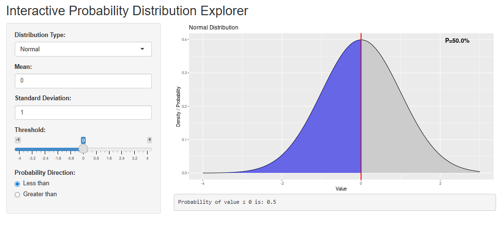{width="70%"}](https://arisci.shinyapps.io/DistributionsBiometrics/)


### Summary Table

```{r, echo=F, eval=T, results='asis'}
# Create flextable
 printTable( 'Gaussian')

```

### Why so important in statistics?

- the maths for the normal were tractable and had easy, closed solutions
- something called the Central Limit Theorem which states that with large sample sizes, sampling mean converge to a normal distribution

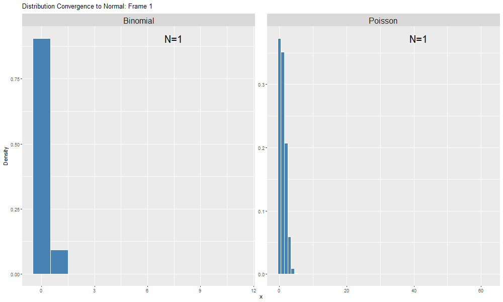

## Log-normal

### Rationale behind log normal

- processes are multiplicative rather than additive
- ecological examples: populate growth rate [ $N(t) = N_0 \cdot \lambda^t$],
                       concentration =  [ $Amount = Volume \cdot concentration$]
                       body mass = again dealing with volume [allometry]


### Key parameters for location and spread/variance

__Location:__ $\mu$
__Variance:__ $\sigma^2$ 

$$
y \sim \text{LogNormal}(\mu, \sigma)
$$
[Wikipedia LogNormal](https://en.wikipedia.org/wiki/Log-normal_distribution)

_click on image_

[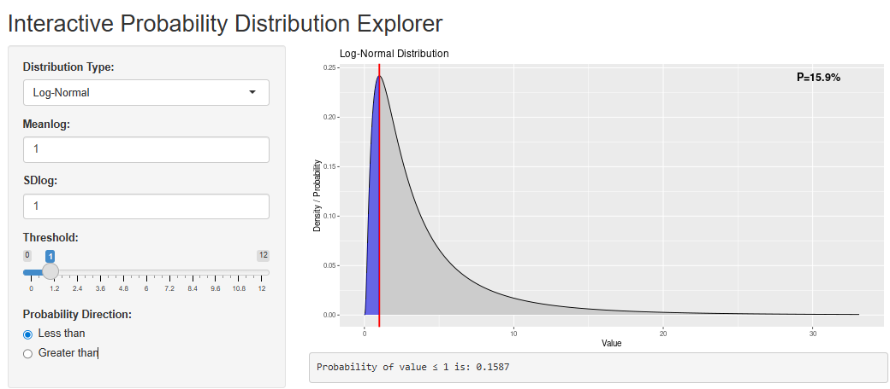{width="70%"}](https://arisci.shinyapps.io/DistributionsBiometrics/)


### Summary Table

```{r, echo=F, results='asis', eval=T}
# Create flextable
 v_order <- c('Gaussian','Log-normal')
 printTable(v_order)

```


### log(Y) vs Lognormal

You probably have learned about log-transforming Y to do the following:
1)  stabilize variance
2)  normalise the data
3)  linearise relationships

When working with log(y), all predictions are in logs.

```{r echo=F, eval=T, fig.height=3, fig.width=8}
  ds <- data.frame( y= rlnorm(1000, 1, 1) )
  cowplot::plot_grid(
    ggplot(ds, aes(y)) + geom_histogram(col='white') + labs(title='Raw data'),
    ggplot(ds, aes( log(y) )) + geom_histogram(col='white') + labs(title='logged data'),
    nrow=1
  )  
```
```{r echo=F, eval=T, fig.height=3, fig.width=8}
  ds <- data.frame( y= rlnorm(1000, 1, 1) )

  MASS::fitdistr(ds$y, 'lognormal')
  MASS::fitdistr( log(ds$y), 'normal')

```


## Beta distribution

### Rationale behind beta distribution

- Beta distribution derived several ways, all pretty mathematical (e.g. conjugate prior, order statistics (kth smallest from n uniform(0,1) samples) )

-  The Beta distibution is mainly phenomenological/convenience distribution in ecology. 


### Key parameters for Beta and location/variance

The main parameters for Beta are shape parameters...
_shape1(/alpha)_: think as number of successes
_shape2(/beta)_: think as number of failures


This shape parameters can be combined to define location and variance

__Location:__ $\mu = \frac{\alpha}{\alpha + \beta}$
__Variance:__ $\sigma^2 = \frac{\alpha \beta}{(\alpha + \beta)^2 (\alpha + \beta + 1)}$

Note - range of values (0,1)

$$
y \sim \text{Beta}(\alpha, \beta)
$$

_click on image_

[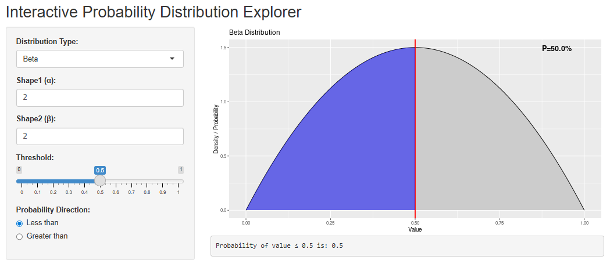{width="70%"}](https://arisci.shinyapps.io/DistributionsBiometrics/)


### Summary Table


```{r, echo=F, eval=T}
# Create flextable
 v_order <- c('Gaussian','Log-normal','Beta')
 printTable(v_order)

```


#  Discrete distributions

## Binomial(/Bernoulli)

### Rationale behind binomial

- derived from probabilistic/theoretically derived
-  in ecology, the distribution fits many scenarios like survival rates, presence/absence

_Note: the Bernoulli distribution is a special case of Binomial in which only one sampling event occurs_


### Key parameters for binomial

p- probability an event
N- number of trials (e.g. number of animals tested)

Location: $\mu = N*p$
Variance: $\sigma^2 = N * p * (1 - p)$

_Note - variance increases as p nears 0.5_

$$
y \sim \text{Binomial}(p, N)
$$

_click on image_

[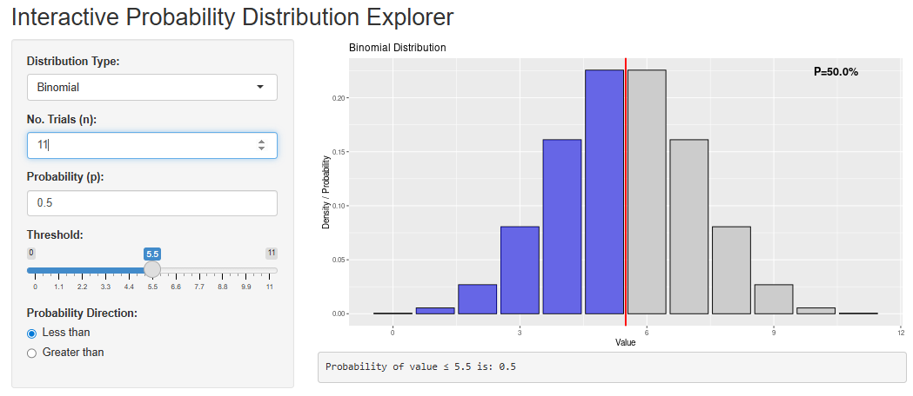{width="70%"}](https://arisci.shinyapps.io/DistributionsBiometrics/)

### Summary Table

```{r, echo=F, eval=T}
# Create flextable
 v_order <- c('Gaussian','Log-normal','Beta','Binomial')
 printTable(v_order)
```


## Poisson

### Rationale behind Poisson

- derived from probabilistic/theoretically derived.  
-  Poisson is about __the rate__ an event happens (e.g.number times/hour)
- in ecology, the distribution fits many scenarios, often do to sampling design and measuring rates.  For instance, number of individuals per sampling area (N/area), number of fish through fishway per hour (n/hr), number of plant stems touching a stick (n/stick)


### Key parameters for Poisson

$\lambda$- rate that an event happens

Location: $\mu=\lambda$
Variance: $\sigma^2 = \lambda$

_Note - variance increases as the rate_

$$
y \sim \text{Poisson}(\lambda)
$$

_click on image_

[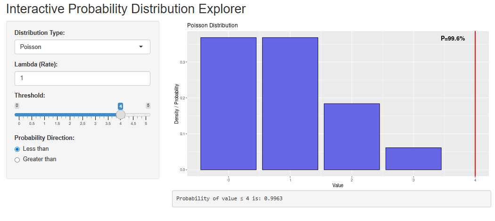{width="70%"}](https://arisci.shinyapps.io/DistributionsBiometrics/)


### Summary Table

```{r, echo=F, eval=T}
# Create flextable
 v_order <- c('Gaussian','Log-normal','Beta','Binomial','Poisson')
 printTable(v_order)


```


## Negative Binomial

### Rationale behind Negative Binomial

-  derived from probabilistic/theoretically derived [from gambling, wanting to know how many trials are needed to achieve a certain number of successes]
-  another approach was allowing Poisson distribution $\lambda$ to vary (as Gamma distribution).  This is closer to our use in ecology
-  I would argue more of a convenience distribution in ecology
-  Negative binomial is used lots as often Poisson underestimates variability.  E.g. not every plot is equally attractive to an animal (animal spacing problem)

<aside> Lot of the early thinking about probabilities and stochastic events originated in the gambling/games of change world although back to 1500s.  This tradition has extended to the present day  </aside>

### Key parameters for negative binomial

Location: $\mu$
Variance/dispersion: size ($\theta$) [ decreasing size = higher overdispersion ]

_Note - as _

$$
y \sim \text{NegativeBinomial}(\mu, \theta)
$$

_click on image_

[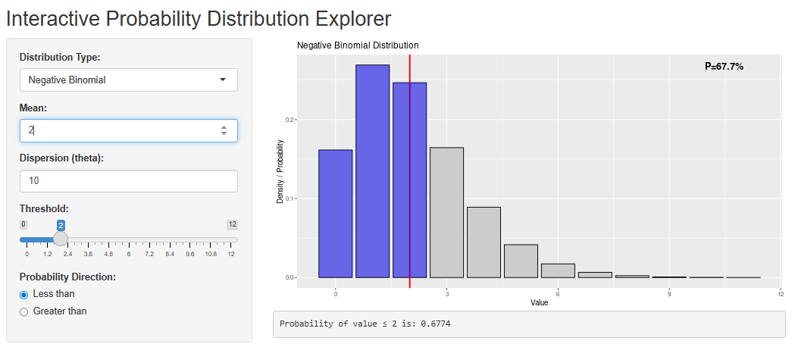{width="70%"}](https://arisci.shinyapps.io/DistributionsBiometrics/)


------------------------------------------------------------------------

# Observation vs Process framework

### Let's build up an example...

```{r fig.width=8, fig.height=3, eval=T, echo=T}
# grab the data
  library(dslabs)  # package with the dataset
  data(heights)
  ds_hts <- heights
  head(ds_hts)

# visualise the data  
  cowplot::plot_grid(
    ggplot(ds_hts, aes(sex, height) ) + geom_violin(),
    ggplot(ds_hts, aes( height, fill=sex) ) + geom_density( alpha=0.2 ),
    nrow=1
  )
  
# get key parameters
  ds_stat <- group_by(ds_hts, sex) %>% 
    summarise( ht_mean = mean(height), sd_ht = sd(height)) %>% 
    ungroup() %>% 
    mutate(diff_mean = diff(ht_mean))
  
```


#### Equation

$$
height_{male} \sim \text{Normal}(\mu_{male}, \sigma_{male})
$$
$$
height_{female} \sim \text{Normal}(\mu_{female}, \sigma_{female})
$$
Let's assume males and females have the same variation: $\sigma_{female}$ = $\sigma_{male} =  \sigma$

$$
height_{male} \sim \text{Normal}(\mu_{male}, \sigma)
$$
$$
height_{female} \sim \text{Normal}(\mu_{female}, \sigma)
$$

Okay, let's now simplify more 

$$
y_i \sim \text{Normal}(\mu_i, \sigma)
$$
where i = male or female and $y_i = height_i$


$$
\mu_i = sex
$$
<br>


#### Observation component (distribution)

$$
y_i \sim \text{Normal}(\mu_i, \sigma)
$$


#### Process component

$$
\mu_i = sex 
$$

More accurately...
$$
p_i = Intercept + Male*X  
$$

#### the R formula

```{r eval=F, echo=T}
  glm( height ~ sex, data=ds_hts, family=gaussian )
```


### Example with the coins

#### Observation component (distribution)

$$
y_i \sim \text{Binomial}(p_i, N)
$$
where i = fair or weighted and $y_i = n_{successes}$

#### Process component

$$
p_i = \text{coin_type} 
$$

More accurately...
$$
p_i = Intercept + Weighted * X 
$$


#### the R formula

```{r eval=F, echo=T}
  ds_coin <- rename(ds_coin, coin_type=trt) %>% 
              mutate(n_failures= n_total-n_success)
  glm( cbind(n_success, n_failures) ~ coin_type, data=ds_coin, family=binomial )
  
```


__Bonus question: what do random effects (such are a statistical distribution) come into the observation-process model formulation???__


------------------------------------------------------------------------

# What about non-parametric approaches?  Where do they fit in?


**1. Limited Modeling Flexibility**

<span style="font-size:80%">
- Nonparametric tests (e.g., Mann–Whitney U, Kruskal–Wallis) are typically designed for simple comparisons.
- They do not easily accommodate multiple predictors, interactions, or random effects, which are common in ecological models.
</span>


**2. Reduced Statistical Power**

<span style="font-size:80%">
-  Nonparametric tests often have lower power than parametric tests when parametric assumptions are reasonably met.
-  This means a higher chance of Type II errors (failing to detect a true effect).
</span>

```{r, eval=T, echo=T, fig.width=5, fig.height=3}
# set up data
  set.seed(20)
  n=40
  makeData<-function(){
   data.frame( trt=rep( c('ctrl','trt'), each=n ), 
                    resp=c(rnorm(n,10,3), rnorm(n,11,3)) )
  }
  ds <-makeData()
  ggplot( ds, aes(resp, fill=trt) ) + geom_density(alpha=0.4)
  wilcox.test( resp~trt, data=ds) 
  summary(lm(resp~trt, data=ds) )
```


```{r, eval=T, echo=T, fig.width=5, fig.height=3}
# run tests as nonparametric and parametric and look at power
  runTest <- function(d){ 
    bind_rows(
      broom::tidy(wilcox.test( resp~trt, data=d)) %>% select(method, p.value),
      broom::tidy(lm(resp~trt, data=d) ) %>% select(p.value) %>% mutate(method='parametric')
    )
    }
  ds_sim <- map_dfr( 1:100,~makeData() %>% mutate(rep=.x) ) %>%
            group_by(rep) %>% nest() %>% mutate( data= map(data, runTest) ) %>% 
            unnest('data') %>% mutate(sig= p.value<0.05) 
  group_by(ds_sim, method) %>% summarise( power=sum(sig)/n() ) %>% 
    ggplot(aes(method, power) ) + geom_col(fill='blue',col='black') +
      scale_y_continuous( labels=scales::percent ) + ylim(0,1)

```

**3. Difficulty Handling Complex Designs**

<span style="font-size:80%">
- Repeated measures, nested data, or hierarchical structures are hard to model with traditional nonparametric tests.
- Mixed models or generalized linear models (GLMs/GLMMs) are better suited for such designs.
</span>

**4. Interpretation Challenges**

<span style="font-size:80%">
- Nonparametric tests typically assess ranks rather than actual values.
- This makes it harder to interpret effect sizes or make predictions based on model coefficients.
</span>

**5. Limited Diagnostic Tools**

<span style="font-size:80%">
- Parametric models offer rich diagnostics (e.g., residual plots, AIC/BIC, goodness-of-fit).
- Nonparametric tests lack these tools, making it harder to assess model adequacy.
</span>

**6. Assumption of Independence**

<span style="font-size:80%">
- Many nonparametric tests assume independent observations.
- Violations (e.g., spatial or temporal autocorrelation) can lead to misleading results.
</span>

**7. No Direct Extensions to Multivariate Data**

<span style="font-size:80%">
- Nonparametric tests are not easily extended to multivariate or multilevel data structures.
- Techniques like PERMANOVA exist but have their own limitations and assumptions.
</span>

<aside>The adoption of parameteric distribution into multivariate methods replacing non-parametric methods.  Dave Warton (UNSW) has done a lot in this space, such as [mvabund](https://www.youtube.com/watch?v=KnPkH6d89l4) and more recent [gllvm](https://jenniniku.github.io/gllvm/) </aside>


{width="90%"}


