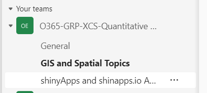

```{r setup, include=FALSE}
knitr::opts_chunk$set(echo = FALSE)
```

# Acknowledgement of country

I would like to begin by acknowledging the traditional owners of the land on which we are meeting today, the Wurundjeri people of the Kulin Nation, and pay my respects to their Elders past, present and emerging.

------------------------------------------------------------------------

# Workshop Structure

This is a 4-day workshop ( SEP16-19 2024) with each day running from 9am-12pm. During each day's session, we will cover a new topic in the workflow pipeline.

-   Monday: Overview of workflow, importing, cleaning (Ben)

-   Tuesday: Analysis of data (Paul)

-   Wednesday: Creating reports (Paul)

-   Thursday: Creating shiny Apps (Ben)

Within each day, the session is structured to be mainly 'talk-and-chalk' for the first half and then more hands-on for the second half.

\*\* Notes \*\*

1.  We will not be offended if **you just stay for the first half**

2.  **Ask questions** anytime. Most likely someone else will have the same question. We may defer the question to hands-on section if it is too much of rabbit-hole.

3.  We will have a wide range of skills across the days

**Most Importantly, tea will be provided!! `r emo::ji("happy")`**


------------------------------------------------------------------------

# What the workshop is trying to do

-   Become familiar with data analyst workflow
-   Learn a workflow from data cleaning to analysis to presenting/communicating results in one platform
-   Increase your knowledge about the R workflow, resources, and capabilities `r emo::ji("+1")`
-   Provide a resource to refer to to help remind you how to get going 

# What is it **NOT** trying to do

-   Turn you into a R programmer/Shiny app developer in 4 days
-   Going in-depth into any specific topic (except R workflow)
-   Make you cry `r emo::ji("cry")`


------------------------------------------------------------------------

# What to expect

## Approach

Compared to when we started providing biometrics workshops, the amount of resources and online learning tools has exploded. Partly as a consequence, there has been a homogenization of workflow driven by key leaders in the area that have pushed the technology and analysis paradigms.

Given this, we will attempt in this workshop to act more as a guide to help you develop a solid framework that you can use as a launching point. We will point out amazing resources out but also hoping that the workshop will give you the foundation to dive deeper into the topics specific to your research/needs.  Part of this is introducing to you to tools/concepts as well as introducing to the terminology in R workflows. 

## May need to take a step-back at times

For some, the last two days of the workshop might push their limits but the skills in these session are becoming more important as the expectation of how we communicate our research grows and evolves.

On Day 3 (creating reports), the Quarto(/Rmarkdown) approach takes a bit to get used to if you are used to WYSIWYG (**W**hat **Y**ou **S**ee **I**s **W**hat **Y**ou **G**et). The key is to focus on the higher level concepts (e.g. focusing on the higher level concepts of how it could be useful for your research). Most importantly, once you have a template to work from and understand key fundamentals, you can easily modify  (often having no clue how most of it works...my approach for years to be honest).

Now, for Day 4 (Shiny Apps), Shiny is going to look, frustratingly, different as shown below:

```{r shine_ex, include=T, echo=T,eval=F, collapse=T}
library(shiny)

# Define UI for application that draws a histogram
ui <- fluidPage(
  fluidRow( 
    selectInput('x','X-Variable', choices = names(mtcars)),
    selectInput('y','Y-Variable', choices = names(mtcars)),
    plotOutput('plot') 
)
)
# Define server logic required to draw a histogram
server <- function(input, output, session) {
  output$plot <- renderPlot({
    plot( mtcars[,input$x], mtcars[,input$y] )
    
  })
}# Run the application 

shinyApp(ui = ui, server = server)
```

However, shiny apps have a very basic structure and once you get that (and a few other key bits), you can often grab other people's code and modify slightly to get what you need.

Reminder - The goal here is **not to make you a programmer** but familiar with a few key tools so that you can tinker away.

------------------------------------------------------------------------

# Course Website

Obviously, there is a course website.  For those that attended the masterclass on R spatial capabilities orchestrated by Justin Cally, the website design will be familiar.  It is a blog-centric website and we will add each day's lecture the morning of.

<aside>Website is built using `distill` package and hosted by github pages</aside>

By the nature of this workshop, we have limited time and cannot go in-depth.  Therefore, we have tried to distill out the key concepts/steps in the course notes, but there might be topics that need additional explanation and examples. If so, Paul and I are happy to write up a short-blurp about it and post it on the "Extra topics" in the upper right.


------------------------------------------------------------------------

# Plug for QEARI

Just a reminder QEARI (**Q**uantitative **E**cology **ARI**) is a great resource and a safe place for asking "dumb" questions. The amount of expertise among its regulars is impressive! There are multiple channels to ask questions including a **new one for shiny Apps**!!!

{width="50%"}

------------------------------------------------------------------------

# What to do when my brain hurts...

Zen out while checking out the 367 Collins Peregrines....

<iframe width="657" height="370" src="https://www.youtube.com/embed/VLLNNTjaSEA" title="367 Collins Falcons 2024 - South facing" frameborder="0" allow="accelerometer; autoplay; clipboard-write; encrypted-media; gyroscope; picture-in-picture; web-share" referrerpolicy="strict-origin-when-cross-origin" allowfullscreen>

</iframe>

<br>
