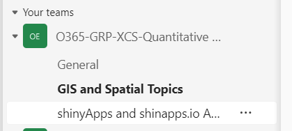

```{r setup, include=FALSE}
knitr::opts_chunk$set(echo = FALSE)
```

# Acknowledgement of country

I would like to begin by acknowledging the traditional owners of the land on which we are meeting today, the Wurundjeri people of the Kulin Nation, and pay my respects to their Elders past, present and emerging.

------------------------------------------------------------------------

# Workshop Structure

This is a 4-day workshop ( SEP16-19 2024) with each day running from 9am-12pm. During each day's session, we will cover a new topic in the workflow pipeline.

-   Monday: Which statistical distribution to pick (Ben)

-   Tuesday: Continuous data models  (Paul)

-   Wednesday: Discrete data models (Ben)

-   Thursday: More advanced models (Paul)

Within each day, the session is structured to be mainly 'talk-and-chalk' for the first half and then more hands-on for the second half.

\*\* Notes \*\*

1.  We will not be offended if **you just stay for the first half**

2.  **Ask questions** anytime. Most likely someone else will have the same question. We may defer the question to hands-on section if it is too much of rabbit-hole.

3.  We will have a wide range of skills across the days

**Most Importantly, tea will be provided!! `r emo::ji("happy")`**


------------------------------------------------------------------------

# At the end of the workshop attendees should be able to:

-   Select which distribution the data comes from
-   Decide which statistical model is appropriate
-   How to construct that model and run it in R
-   Know how to interpret the model results
-   Know what to present to their audience


# What is it **NOT** trying to do

-   Turn you into a R programmer in 4 days
-   Make you cry `r emo::ji("cry")`


------------------------------------------------------------------------

# What to expect

## Approach

Compared to when we started providing biometrics workshops, the amount of resources and online learning tools has grown exponentially.  In particular, AI has become an essential tool and will write R code for you (see [Using AI](help_ai.html) ).  An advantage of this new reality is that we can focus more on the concepts, de-emphasizing the R coding component of the workshop.  Therefore, for those less familiar with R, the __most important thing is understanding the concepts__ and try not to get bogged down by R coding.  That being said, R is at the heart to the workshop and most things will be demonstrated using R.


## Group projects

In this workshop, we’re using group projects as a way to make learning R and statistical modeling more manageable. Working in teams can also help spread out the coding load, so if you’re newer to R, you won’t feel stuck or overwhelmed.  That being said, if you already have the R coding expertise, feel free to work on your own as well.  


------------------------------------------------------------------------

# Course Website

Obviously, there is a course website. It is a blog-centric website and we will add each day's lecture the morning of.

<aside>FYI - Website is built using `distill` package and hosted by github pages</aside>

By the nature of this workshop, we have limited time and cannot go in-depth.  Therefore, we have tried to distill out the key concepts/steps in the course notes, but there might be topics that need additional explanation and examples. If so, Paul and I are happy to write up a short-blurp about it and post it on the "Extra topics" in the upper right of website.


------------------------------------------------------------------------

# Plug for QEARI

Just a reminder QEARI (**Q**uantitative **E**cology **ARI**) is a great resource and a safe place for asking "dumb" questions. The amount of expertise among its regulars is impressive! 

{width="50%"}


<br>
