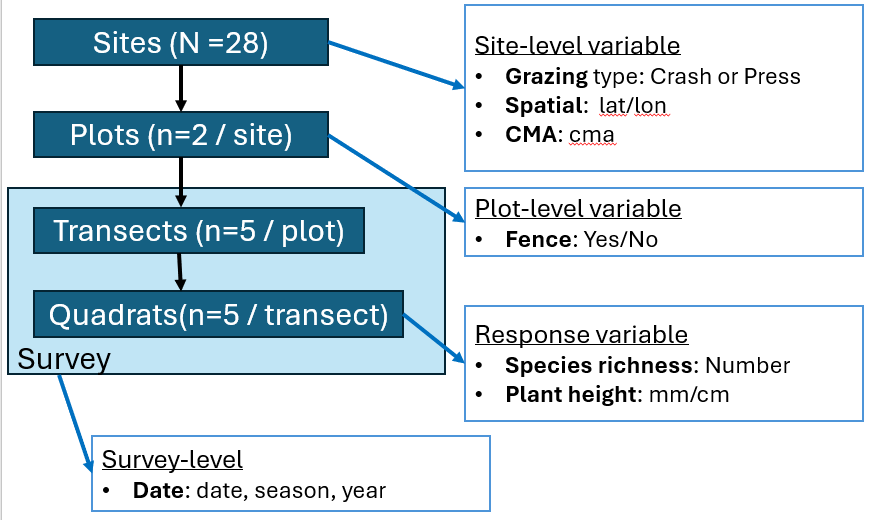

```{r setup, include=FALSE}
knitr::opts_chunk$set(echo = FALSE)
library(tidyverse)
```

# Project data

For the workshop, we will be using a greatly reduced dataset from the **W**etland **I**ntervention **M**onitoring **P**rojects (WIMP; thanks Kay Morris `r emo::ji('clap')`).

<aside>We have done some masking of data</aside>

**Each day we will provide a Rstudio project that will have the data as well.** If you want to start from scratch, click on link below to download project data files and go from there.

```{r download_data, echo=FALSE, code_folding = FALSE}
library(downloadthis)
  download_link(
    link='https://delwpvicgovau-my.sharepoint.com/:u:/g/personal/ben_fanson_deeca_vic_gov_au/EW7Gq9EXVetFkpM4nIi3k10Bo8TAyze6LuoMC6Z1zu4rTA?e=sWJhQU',
    output_name = "Attendance list.xlsx",
    button_label = "Download project data",
    button_type = "warning",
    has_icon = TRUE,
    icon = "fa fa-save"
  )
```

<br>

# Project overview

## Purpose

**Goal:** Improve grazing management

**Question:** How does grazing intensity affect wetland plants?

**Framework:** The ecological framework underpinning this study is the [Intermediate Disturbance Hypothesis](https://en.wikipedia.org/wiki/Intermediate_disturbance_hypothesis).

**Grazing treatment:** Here, we focus on two types of grazing: **Press** (low intensity for longer) and **Crash** (high intensity for shorter).

```{r}
 cowplot::ggdraw() + cowplot::draw_image('images/dataset/idh.PNG')
```

<br>

## Experimental design

### Study sites

Across western and eastern Victoria, a total of 28 sites were selected to be surveyed. These sites were spread across four **C**atchment **M**anagement **A**uthorities (CMA) but with the majority of sites in the western CMAs. Sites were chosen partly to cover a wide variation in grazing intensity and grazing treatment.

```{r echo=F, fig.height=4, fig.width=7}
  # sf_site <- sf::read_sf('data/sf_site.gpkg') %>% select(-transect_id)
  # # sf_cma <- VicmapR::vicmap_query(layer='open-data-platform:cma100') %>% VicmapR::collect()
  # sf_cma <- sf::read_sf('data/sf_cma.gpkg')  
  # mapview::mapview(sf_cma, zcol='cmaname', layer.name='cma') + 
  #   mapview::mapview(sf_site, zcol='grazing', layer.name='site', col.regions=c('red','blue') )

```

### Monitoring

In each wetland, we are assessing how vegetation changes over time inside two trial plots. Each trial plot is about 0.25 ha in size. One plot is open to the grazing management being applied in the wetland and the other plot is fenced to exclude livestock (sheep and cattle). Monitoring is done when the wetland is drying out but still wet as this is the when most wetland plants are present. Monitoring is done along **transects and quadrats** in each plot before fencing, and then **every year after fencing for 3-5 years**.


### Design variables

So, we have a hierarchical experimental design: site/plot/transect/quadrant. First we have the site-level. At this level, we have the grazing treatments: Crash (intense grazing, shorter) and Press (less intense, longer). Next, we have a paired design within a site with fence. Within plot we have transects and within transect, quadrats.

At the quadrat level, a large suite of responses were measured in this study. For the workshop we will focus on two response metrics measured at the quadrat level:

-   **Native species richness**: total number of native species (summarised by transect-level)

-   **Maximum plant height:** measured the tallest plant in the quadrat





# Data provided

## Overview

We have three files:

-   **`Workshop 2024 data.xls`** - this is our main file

-   **`df_survey_info.csv`** - this contains survey info, such as date

-   **`df_quad_spp.csv`** - this includes extra quadrat-level about species present

Let's take a look at snapshot of each file

## **Workshop 2024 data.xls**

This workbook has four tabs of data.

### **site_info** tab

{width="110%"}


