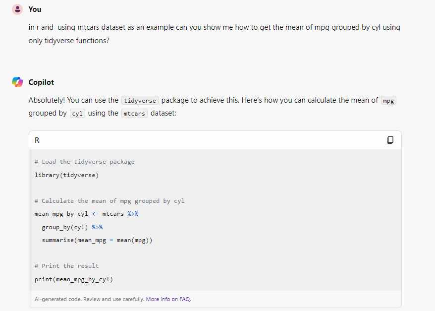
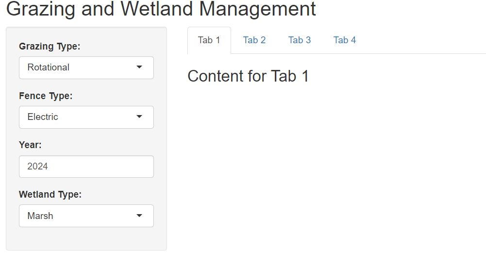

```{r setup, include=FALSE}
knitr::opts_chunk$set(echo = TRUE)
library(tidyverse)
```

# Using **A**rtifical **I**ntelligence (AI) for coding

AI is becoming useful coding tool.  I have found myself using more and more to find code examples that something I just cannot find using Google.  It has probably become my go to for finding R coding information.

There are lots of AI platforms out there and have not used most.  The one I use most is Copilot (Microsoft) since we get access to that through DEECA. 

## A few AI options

Below is a list of a few AI that I have tinkered with (except Copilot (Github) but been recommended to me).  [If someone has one that they find really useful, let me know and I can add here].  

-   **Copilot (Microsoft)**: allrounder AI which we have a free subscription at ARI. It does a decent job [I use this one daily]

-   **ChatGPT**: another allrounder similar to Copilot

-   **Claude**: prefer this one for writing text but seems to work well for programming as well

-   **Copilot-GitHub**: paid subscription but supposedly really good for programming

## Tips for working with AI

For those not regularly using AI, there are a few things that can help when running your searches for help:

-   Include specifics: when asking for an example, include lots of specific to get closer to what you want. You may want to tell it to use only tidyverse functions for the example code or a certain package. 

-   Built-in datasets: if possible, ask it to use a built-in dataset for the example so that I can check it right away in R

-   Experiment and Iterate: Don't be afraid to experiment with the code generated by AI. Modify it, run it, and see what happens. If something is not working, you can ask AI to proofread its own code and sometimes it can fix it.

-   Use AI for Debugging: If you encounter errors, AI tools can help you debug your code. They can suggest fixes and optimizations, making the debugging process less daunting.

## Copilot examples

To you Copilot, go to [copilot](https://copilot.microsoft.com/).

Below are a couple examples...

- type..."*in R and using mtcars dataset show me how to get the mean mpg by each cyl level?*" - if it used the `aggregate()` function, type the followup: "*can you use tidyverse functions instead?*"

Example of the output




- type..."*build me a R shiny app UI that has four tabs in the main panel and a side panel that has four user inputs.  One input for grazing type, one for fence type, one for year, and one for wetland type*"

I got a working interface...



<br>

Below is the code AI gave me...see day 4 lecture for explanation of code.

<br>
```{r eval=F}
library(shiny)

# Define UI
ui <- fluidPage(
  titlePanel("Grazing and Wetland Management"),
  
  sidebarLayout(
    sidebarPanel(
      selectInput("grazing", "Grazing Type:", 
                  choices = c("Rotational", "Continuous", "Deferred")),
      selectInput("fence", "Fence Type:", 
                  choices = c("Electric", "Barbed Wire", "Wooden")),
      numericInput("year", "Year:", value = 2024, min = 2000, max = 2100),
      selectInput("wetland", "Wetland Type:", 
                  choices = c("Marsh", "Swamp", "Bog", "Fen"))
    ),
    
    mainPanel(
      tabsetPanel(
        tabPanel("Tab 1", h3("Content for Tab 1")),
        tabPanel("Tab 2", h3("Content for Tab 2")),
        tabPanel("Tab 3", h3("Content for Tab 3")),
        tabPanel("Tab 4", h3("Content for Tab 4"))
      )
    )
  )
)

# Define server logic
server <- function(input, output) {
  # Server logic will go here
}

# Run the application 
shinyApp(ui = ui, server = server)

```


