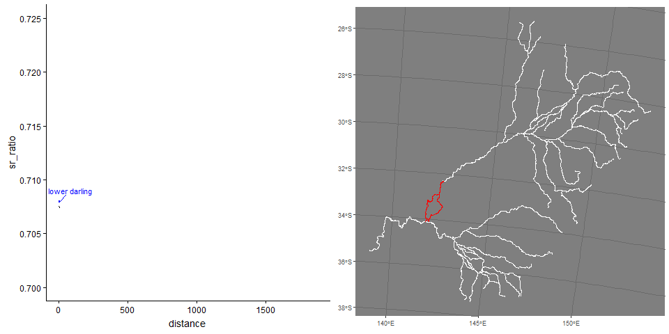

```{r setup, include=FALSE}
knitr::opts_chunk$set(echo = TRUE)
library(tidyverse)
```

Below is just a coarse overview of ggplot2.  See the following [ggplot tutorial]( https://rstudio.github.io/cheatsheets/html/data-visualization.html) for more examples.  Lots of other tutorials out there.

# Overview 

## ggplot()

All plots start with `ggplot()` function.  In this function, you tell it what data to use for all added layers and what are the x/y variables.   Here, I will plot hp (horsepower) vs mpg (miles per gallon). 

```{r}
#  head(mtcars) # have a look at
  ggplot( mtcars, aes(x=hp, y=mpg) )
  
```

## geoms (geometric shape)

Above shows the setup of the plot, it has no points/lines (aka geometric shapes) because we have not specified `geom_xxx()` (e.g. geom_point, geom_line(), geom_boxplot)

```{r}
  ggplot( mtcars, aes(hp, mpg) ) +  # notice you can drop x=,y=
      geom_point()  # new layer to add points
```
You can change attributes for the point
```{r}
  ggplot( mtcars, aes(hp, mpg) ) +  
      geom_point( color='red', shape=4, size=3)  # change attributes
```

You can just add more and more layers.  You might want to add a smoother.

```{r}
  ggplot( mtcars, aes(hp, mpg) ) +
      geom_point() +
      geom_smooth()  # add a smoother/relationship
```
## formatting

Now, let's see some basic changes that you might want to do...

```{r}
  ggplot( mtcars, aes(hp, mpg) ) +
      geom_point() +
      geom_smooth(fill='blue', alpha=0.2 ) + # change color of the error band
        labs( x='Horsepower', y='MPG', title='Title') + # add in some labels
        ylim(0,40)  # set y-axis limits

```
There are different `theme_xxx()` in ggplot to change how the graph looks...

```{r}
  ggplot( mtcars, aes(hp, mpg) ) +
      geom_point() +
      geom_smooth(fill='blue', alpha=0.2 ) + 
        labs( x='Horsepower', y='MPG', title='Title') +
        ylim(0,40) +
        theme_classic()  # there are themes that change overall formatting... type theme_ and see what autofills

```

## grouping variables within a panel

Often you want to break a graph apart by a group variable (like a treatment factor).  You can do this by setting an attribute: `color=`,`alpha=` (transparency), `size=` (makes a bubble plot).


```{r}
  ggplot( mtcars, aes(hp, mpg, color=factor(cyl) ) ) + # using factor to turn cyl from numeric to character/factor
      geom_point() +
      geom_smooth( method='lm')  # running linear model
```


```{r}
  ggplot( mtcars, aes(hp, mpg ) ) + # using factor to turn cyl from numeric to character/factor
      geom_point( aes(size=factor(cyl), color=factor(cyl) ) ) + # I am going to add here so only point change
      geom_smooth( method='lm')  # running linear model
```


## faceting (multi-panel)

For one variable you can use `facet_wrap(~group)` or `facet_grid(~group)`.  For two variables, use `facet_grid(grp_1~grp_2)`

```{r}
  ggplot( mtcars, aes(hp, mpg, color=factor(cyl) ) ) + 
      geom_point() +
      geom_smooth( method='lm') + 
        facet_wrap(~cyl, ncol=2)  # added a variable to break up 
```

The `facet_grid()` is setup that the first variable determines row and second the column [facet_grid(row ~ column)]

```{r}
  ggplot( mtcars, aes(hp, mpg, color=factor(cyl) ) ) + 
      geom_point() +
      geom_smooth( method='lm') + 
        facet_grid(~cyl, scales='free_x') 
```


```{r}
  ggplot( mtcars, aes(hp, mpg, color=factor(cyl) ) ) + 
      geom_point() +
      geom_smooth( method='lm') + 
        facet_grid(cyl~vs)  # added a variable to break up two variables
```


# interactive

For interactive ggplots, there are packages that convert a ggplot object to an interactive object. See two packages below:

## convert to plotly

Now, `plotly` package does a great job at interactive plots. You can write you code in ggplot and then just convert as shown in code below.

```{r out.height='500px', out.width='500px', echo=T, include=T}
  library(ggplot2)
  library(plotly)
  f <- ggplot( cars, aes(speed, dist)  ) + geom_point() + geom_smooth()
   plotly::ggplotly(f)

```

## ggiraph

`ggiraph` package

```{r ggiraph_ex, include=T, echo=T, include=T}
library(ggiraph)
library(tidyverse)
library(patchwork)

mtcars_db <- rownames_to_column(mtcars, var = "carname")

# First plot: Scatter plot
fig_pt <- ggplot(
  data = mtcars_db,
  mapping = aes(
    x = disp, y = qsec,
    tooltip = carname, data_id = carname
  )
) +
  geom_point_interactive(
    size = 3, hover_nearest = TRUE
  ) +
  labs(
    title = "Displacement vs Quarter Mile",
    x = "Displacement", y = "Quarter Mile"
  ) +
  theme_bw()

# Second plot: Bar plot
fig_bar <- ggplot(
  data = mtcars_db,
  mapping = aes(
    x = reorder(carname, mpg), y = mpg,
    tooltip = paste("Car:", carname, "<br>MPG:", mpg),
    data_id = carname
  )
) +
  geom_col_interactive(fill = "skyblue") +
  coord_flip() +
  labs(
    title = "Miles per Gallon by Car",
    x = "Car", y = "Miles per Gallon"
  ) +
  theme_bw()

# Combine the plots using patchwork
 combined_plot <- fig_pt + fig_bar + plot_layout(ncol = 2) 

# Combine the plots using cowplot
# combined_plot <- cowplot::plot_grid(fig_pt, fig_bar, ncol=2) 

# Create a single interactive plot with both subplots
interactive_plot <- girafe(ggobj = combined_plot)

# Set options for the interactive plot
girafe_options(
  interactive_plot,
  opts_hover(css = "fill:cyan;stroke:black;cursor:pointer;"),
  opts_selection(type = "single", css = "fill:red;stroke:black;")
)
```

# animate

Check out [ggnimate](https://gganimate.com/) to see a tutorial

Example showing strontium profiles over life of a fish and likely location.




