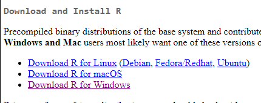
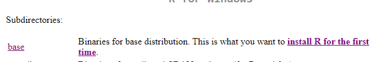
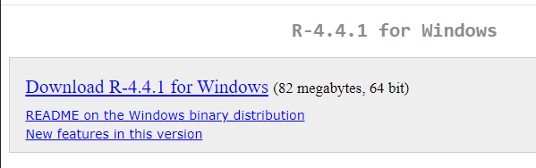
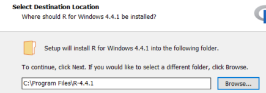
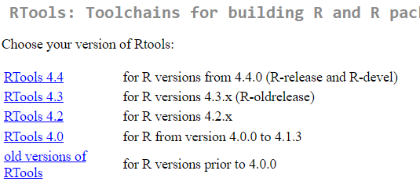
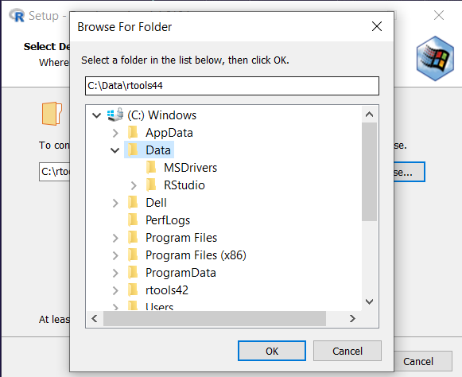
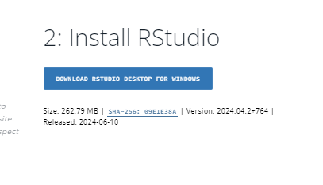
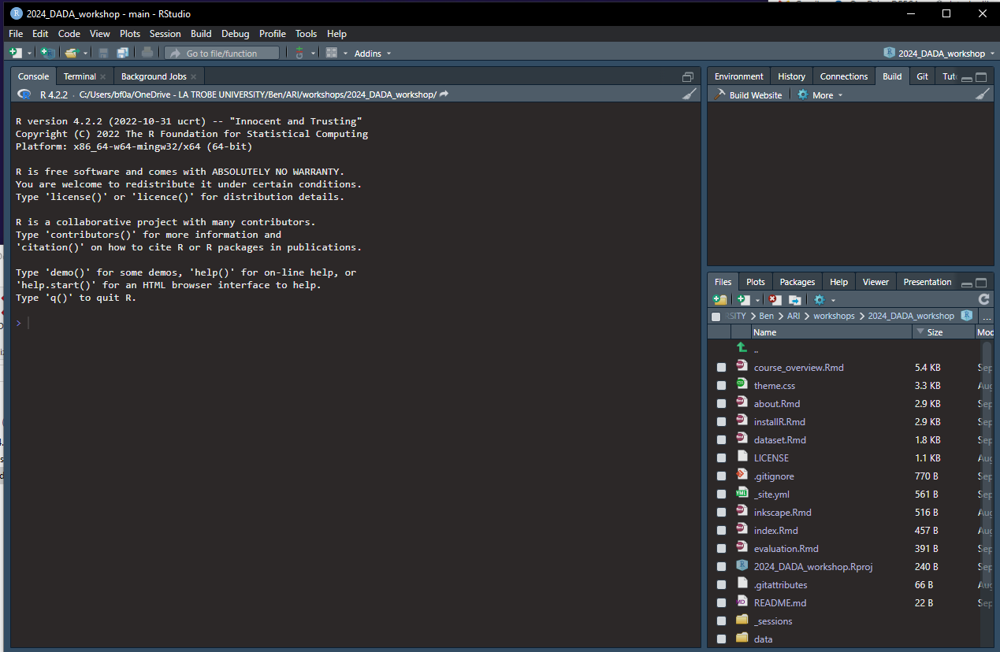
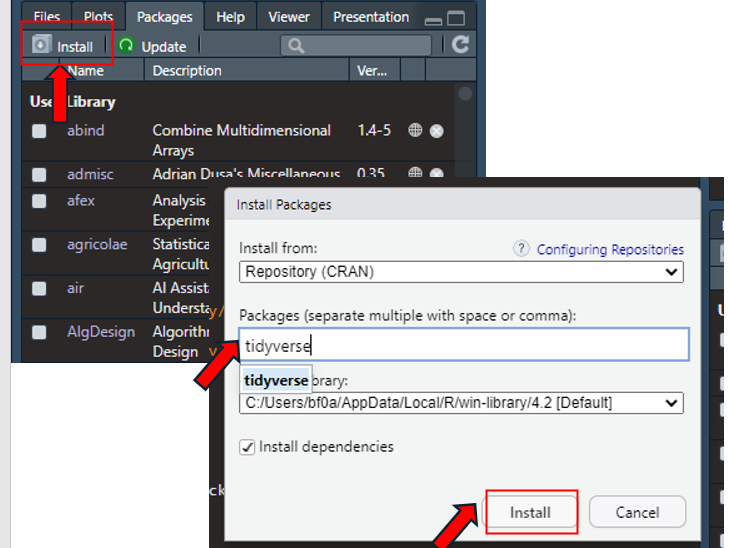

```{r setup, include=FALSE}
knitr::opts_chunk$set(echo = FALSE)
```

# Before the workshop

You will need `R` installed on your machine. If your current `R` version is \<4.0, it is a good time to update. `R` is the programming software that does the computations for your analyses. but using `R` is made much easier by using it through `RStudio` which is an IDE (**I**ntegrated **D**evelopment **E**nvironment). Therefore, you will need to install `Rstudio` as well. Finally, you will need something called `rtools` to help install certain packages in `R`.

*Note - If you are using a DEECA machine and and you do not have an open workstation then you may find it difficult to install `R`, `RStudio` and a range of `R` packages. It is recommended you have a workstation setting that allows you to download and install programs (like `R` and `R` packages). This is something you need to apply for through the DEECA IT service portal if you have not already.*

To install, the order of steps are as follows (for DEECA computers):

1.  Install `R` go to <https://cran.rstudio.com/> and do the following:

    -   click "Download R for Windows"

        {width="90%"}

    -   click "base"

        {width="90%"}

    -   click 'Download R-4.4.1 for Windows'

        {width="90%"}

    -   click the downloaded 'R-4.4.1-win.exe' to start install

    -   when you get to install locations, install to 'C:\\Windows\\Program Files'

        {width="90%"}

    -   accept all defaults along the way

2.  Download the version of `Rtools` matching your `R` installation: <https://cran.r-project.org/bin/windows/Rtools/>

    -   click on 'RTools 4.4'

        {width="90%"}

    -   Scroll down until you see 'Rtools44 Installer' and click on it:

        {width="90%"}

    -   Click on the downloaded 'rtools44-6104-6039.exe' to start install

    -   install to 'C:\\Windows\\Data' and accept defaults

        {width="90%"}

3.  Install `RStudio`: <https://posit.co/download/rstudio-desktop/>

    -   click on 'Download Rstudio....' button

        {width="90%"}

    -   click on 'RStudio-2024.04.2-764.exe'

    -   install to 'C:\\Windows\\Data' like rtools and accept defaults

4.  Open `Rstudio` as you would any other program to check that it opens. If so, move onto installing packages below

    {width="70%"}

# Package Dependencies

One of the strengths of `R` is that it is open-source and collaborators can contribute their own code in the form of packages. For our workshop we will be downloading some packages on the fly, but one `tidyverse` will be across days so please download ahead of time (copy code below and paste into R):

```{r  pkg, eval = FALSE}
install.packages(pkgs = c("tidyverse") )
```

For newbies, click on 'install' button in the `Packages` tab in lower right. Then write in 'tidyverse' and click 'Install'

{width="90%"}
